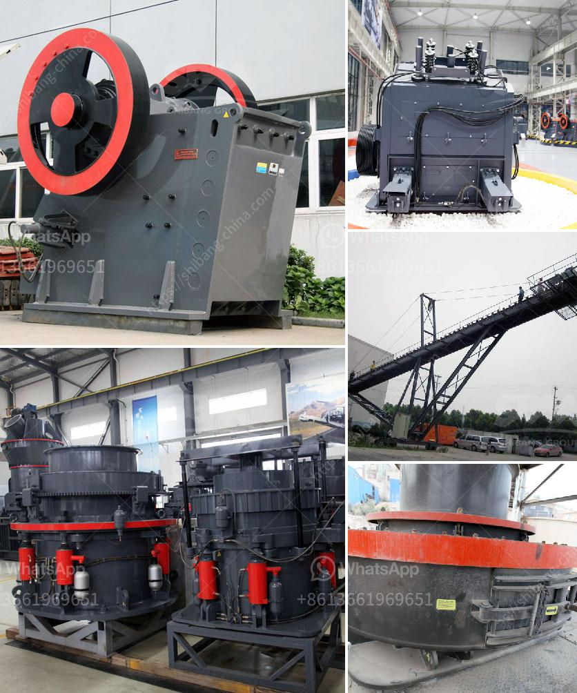

<h3>rock crushing equipment price</h3>
When it comes to rock crushing equipment, there are many factors to consider in order to determine the most suitable price for your specific needs. The type of rock, the desired product size, and the capacity of the equipment are all important considerations that will affect the final price. Here, we will delve into these factors and provide a guide to help you make an informed decision about the price of rock crushing equipment.

One of the primary factors that influence the price of rock crushing equipment is the type of rock being crushed. Different rocks have different hardness levels, abrasiveness, and compressive strengths. For example, granite and basalt are known for their high hardness and can require more durable and powerful equipment. Limestone and sandstone, on the other hand, are relatively softer rocks and can be crushed with less robust equipment. The type of rock being crushed will determine the complexity and cost of the crushing equipment needed.

The desired product size is another important factor to consider. Some applications require precise product specifications, such as a specific size distribution or a specific shape. In such cases, specialized equipment with adjustable settings or specific crushing chambers may be necessary. This type of equipment often comes at a higher price due to its advanced features and customization options. However, if your application does not require such precise specifications, more standard equipment may be suitable at a lower price point.

The capacity of the equipment is also a crucial factor in determining the price. The capacity refers to the maximum amount of rock the equipment can handle per hour. Higher capacity equipment can process larger volumes of material and is generally more expensive. If your application requires high production volumes, investing in higher capacity equipment may be necessary. However, if your needs are relatively modest, opting for a lower capacity equipment can reduce the price significantly.

Apart from the aforementioned factors, other considerations include the quality and durability of the equipment, the operating and maintenance costs, and the availability of spare parts and service support. Investing in high-quality equipment may initially come at a higher price; however, it can result in lower long-term costs, as you will not have to frequently repair or replace parts. It is also important to consider the operating and maintenance costs, such as fuel consumption, labor, and regular maintenance requirements, as these can impact the overall cost of your crushing operation. Availability of spare parts and reliable service support should also be considered to ensure minimal downtime in case of equipment failure.

In conclusion, determining the price of rock crushing equipment involves considering various factors such as the type of rock, desired product size, and capacity requirements. It is important to carefully assess your specific needs and conduct thorough market research before making a purchasing decision. By taking these factors into account, you can ensure that you invest in the right equipment at a fair price, helping you achieve optimal results in your rock crushing operations.
<h3>Contact us</h3><ul><li><strong>Whatsapp:&nbsp;<a href="https://wa.me/8613661969651">+8613661969651</a></strong></li><li><a href="https://swt.shibang-china.com/?git&amp;zhl&amp;rock crushing equipment price"><strong>Online Service(chat now)</strong></a></li></ul><h3>Related</h3><ul><li><a href='cost of setting up a cement plant in usa.md'>cost of setting up a cement plant in usa</a></li><li><a href='brand new stone crusher for sale in the philippines.md'>brand new stone crusher for sale in the philippines</a></li><li><a href='gypsum production line flow chart.md'>gypsum production line flow chart</a></li><li><a href='iron ore crusher price.md'>iron ore crusher price</a></li><li><a href='ball mill fly ash.md'>ball mill fly ash</a></li></ul>