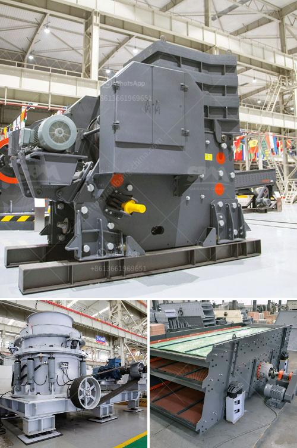

<h3>rock crushing machine price in india</h3>
Rock crushing machines are used for crushing stones into smaller rocks, gravel, or rock dust in India. A rock crusher machine is a machine designed to reduce large rocks into smaller rocks, gravel, or rock dust. Crushers may be used to reduce the size, or change the form, of waste materials so they can be more easily disposed of or recycled, or to reduce the size of a solid mix of raw materials (as in rock ore), so that pieces of different composition can be differentiated.

India is rich in mineral resources, with abundant reserves of limestone, coal, bauxite, and various other minerals. The mining sector in India has witnessed significant growth over the years with the potential for exploration of additional minerals. As a result, the demand for rock crushing machines in India has been steadily increasing.

The price of a rock crushing machine in India depends on the capacity, model, performance, and manufacturer. Rock crushing machines are available in two forms: mobile and stationary. They are commonly used for mining, metallurgy, construction, and highway industries. Some of the popular rock crushing machines in India include jaw crushers, impact crushers, cone crushers, VSI crushers, gyratory crushers, and double roller crushers.

Jaw crushers are primarily used as primary crushers. Their main purpose is to reduce the size of the rock into smaller sizes for the next crushing stages. These machines are widely used in mining, metallurgy, building materials, road construction, and chemical industries. The price of a jaw crusher in India ranges from around INR 85,000 to INR 10,00,000 depending on the capacity, model performance, etc.

Impact crushers are used to crush softer, less dense and abrasive materials such as limestone. They are suitable for both primary and secondary crushing. The price of an impact crusher in India ranges from around INR 30,000 to INR 25,00,000 depending on the capacity, model, etc.

Cone crushers are mainly used for crushing harder, more abrasive materials such as granite, basalt, and quartz. They are commonly used in secondary, tertiary, and quaternary crushing stages. Cone crushers are available in a variety of sizes and capacities, ranging from around INR 50,000 to INR 3,00,00,000 depending on the capacity, model, etc.

VSI crushers (Vertical Shaft Impactors) are suitable for crushing materials with high abrasive index such as river gravel, granite, basalt, and quartzite. They are widely used in the construction industry for producing high-quality aggregates. The price of a VSI crusher in India ranges from around INR 25,000 to INR 20,00,000 depending on the capacity, model, etc.

In conclusion, the price of a rock crushing machine in India varies depending on the model and capacity. However, one can expect to pay around INR 50,000 to INR 20,00,00,000 for a rock crushing machine. The price primarily depends on the manufacturer, features, and performance of the machine. It is advisable to compare different models and their prices before making a purchase to ensure getting the best value for money.
<h3>Contact us</h3><ul><li><strong>Whatsapp:&nbsp;<a href="https://wa.me/8613661969651">+8613661969651</a></strong></li><li><a href="https://swt.shibang-china.com/?git&amp;zhl&amp;rock crushing machine price in india"><strong>Online Service(chat now)</strong></a></li></ul><h3>Related</h3><ul><li><a href='millia deasel grinding mill and prices.md'>millia deasel grinding mill and prices</a></li><li><a href='european stone crusher.md'>european stone crusher</a></li><li><a href='primary jaw crusher.md'>primary jaw crusher</a></li><li><a href='stone crusher price in pakistan.md'>stone crusher price in pakistan</a></li><li><a href='business plan on quarry crusher.md'>business plan on quarry crusher</a></li></ul>