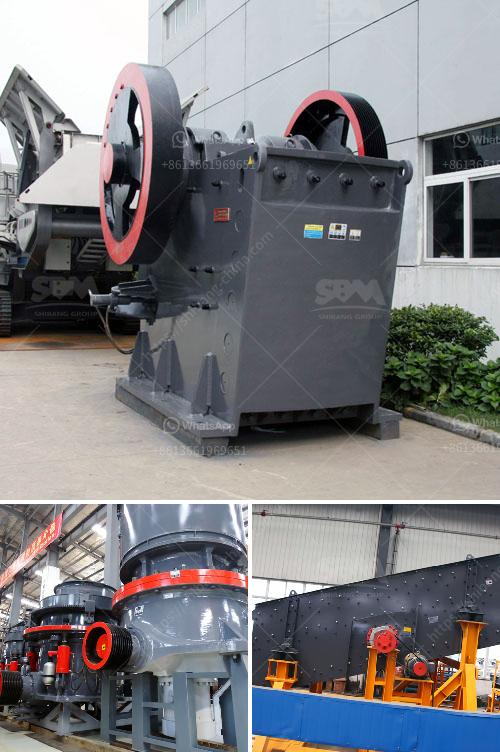

<h3>rock grinder crusher suppliers kenya</h3>
Rock grinding is a vital process in mining and construction industries, especially in Kenya. This stage not only speeds up the production but also provides a proper size for further processing. Rock grinding is the process of breaking down large rocks into smaller pieces suitable for easy handling or for further crushing and grinding. This mechanical technique is widely used in quarries, mines, and construction sites.

To facilitate this process, rock grinders are necessary. Rock grinders are high-performance machines that can take large rocks and reduce them into smaller, more manageable sizes. These machines are used in a variety of industries, including mining, construction, and landscaping.

In Kenya, there are numerous suppliers of rock grinder crushers. These suppliers play a crucial role in the mining and construction industry by providing the necessary equipment and machinery needed for efficient rock grinding. Some of the suppliers in Kenya include:

1. Kenya Crusher Machinery: This is a renowned company that specializes in providing high-quality rock grinder crushers. They have a wide range of products suitable for different applications, including mining, construction, and rock grinding. Their crushers are known for their durability, efficiency, and reliability.

2. Shanghai Zenith Mining and Construction Machinery Co., Ltd: This is a reputable company that supplies rock grinder crushers across Kenya. They offer a wide range of crushers suitable for various applications, including crushing hard rocks, ore minerals, and building materials. Their crushers are designed to provide high crushing efficiency and reduce operating costs.

3. Jaw Crusher Manufacturers: Jaw crushers are widely used in the mining and construction industry for crushing various materials, including rocks. There are several jaw crusher manufacturers in Kenya, such as Linyi Wante Machinery Co. Ltd, Zhejiang Good Mining Machinery Co. Ltd, and Xuzhou Heavy Machinery Co. Ltd, among others. These manufacturers offer a variety of jaw crushers suitable for different applications and budgets.

4. Mobile Crushing Plant Manufacturers: Mobile crushing plants are becoming increasingly popular in Kenya due to their flexibility and convenience. These plants can be easily transported to different construction sites, reducing the need for multiple crushers. Some of the leading mobile crushing plant manufacturers in Kenya include Zhengzhou Dingsheng Engineering Technology Co. Ltd and Henan Hongxing Mining Machinery Co. Ltd.

In conclusion, rock grinders play a crucial role in the mining and construction industry in Kenya. They help break down large rocks into smaller, more manageable sizes for further processing. Several reliable suppliers in Kenya supply high-quality rock grinder crushers suitable for various applications. These suppliers provide efficient and durable crushers that enhance productivity and reduce operating costs. It is essential for mining and construction companies to choose reliable suppliers when purchasing rock grinder crushers to ensure smooth operations and maximize profits.
<h3>Contact us</h3><ul><li><strong>Whatsapp:&nbsp;<a href="https://wa.me/8613661969651">+8613661969651</a></strong></li><li><a href="https://swt.shibang-china.com/?git&amp;zhl&amp;rock grinder crusher suppliers kenya"><strong>Online Service(chat now)</strong></a></li></ul><h3>Related</h3><ul><li><a href='washing process for silica sand.md'>washing process for silica sand</a></li><li><a href='project cost of 100 tpd opc cement plant.md'>project cost of 100 tpd opc cement plant</a></li><li><a href='germany stone crusher.md'>germany stone crusher</a></li><li><a href='gold mining and washing machine usa.md'>gold mining and washing machine usa</a></li><li><a href='ball mill machine in nigeria.md'>ball mill machine in nigeria</a></li></ul>