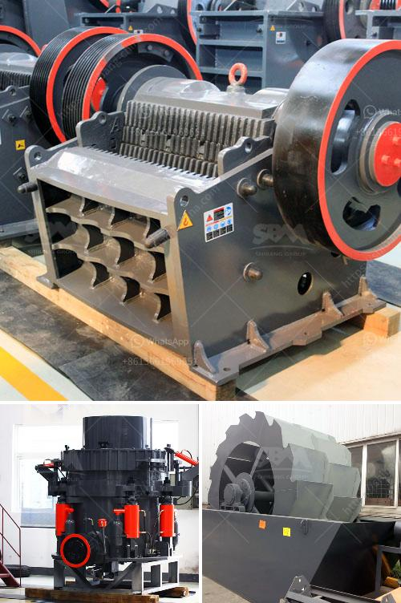

<h3>rock quarry equipment for sale</h3>
Are you looking for an investment opportunity in the lucrative mining industry? One area that holds immense potential is rock quarrying. Demand for rock and mineral products continues to soar in various sectors such as construction, infrastructure development, and the manufacturing industry. If you are considering venturing into rock quarrying, having the right equipment is crucial to your success.

Rock quarrying requires heavy-duty machinery to excavate, transport, and crush large rocks into smaller pieces. These machines play a pivotal role in ensuring smooth operations and maximizing productivity. Fortunately, there is a wide range of high-quality rock quarry equipment for sale in the market. From wheel loaders and haul trucks to crushers and screening plants, the options are endless.

When choosing equipment, it is important to consider factors such as the scale of your operations, the type of rock you will be quarrying, and the specific requirements of your site. For instance, if you are running a small-scale operation, a wheel loader and a mobile crusher might be sufficient. However, for large-scale quarrying, you may require additional equipment such as large excavators, articulated haul trucks, and stationary crushers.

Investing in the right rock quarry equipment can yield significant returns. By streamlining your operations and reducing downtime, you can increase the quantity and quality of the rock products you deliver, ultimately attracting more clients. Additionally, modern machinery offers increased fuel efficiency and reduced emissions, making it more environmentally friendly.

To find the best rock quarry equipment for sale, it is advisable to work with reputable suppliers or dealers. These professionals can provide guidance on the most suitable equipment for your needs and offer valuable after-sales support. Additionally, they can assist with maintenance and spare parts, ensuring that your machinery remains in optimal condition.

In conclusion, rock quarry equipment presents a lucrative investment opportunity for individuals looking to venture into the mining industry. By selecting the right machinery, one can streamline operations, increase productivity, and maximize profits. It is essential to consider the specific requirements of your quarry site and work with reputable suppliers to find the most suitable equipment for your needs. With the right equipment and proper management, success in rock quarrying is within reach.
<h3>Contact us</h3><ul><li><strong>Whatsapp:&nbsp;<a href="https://wa.me/8613661969651">+8613661969651</a></strong></li><li><a href="https://swt.shibang-china.com/?git&amp;zhl&amp;rock quarry equipment for sale"><strong>Online Service(chat now)</strong></a></li></ul><h3>Related</h3><ul><li><a href='quartz plant manufacturing process.md'>quartz plant manufacturing process</a></li><li><a href='stone crusher pe 250x400.md'>stone crusher pe 250x400</a></li><li><a href='crushing b series vsi crusher.md'>crushing b series vsi crusher</a></li><li><a href='stone crushers in south africa.md'>stone crushers in south africa</a></li><li><a href='cost cement plant manufacturers and cost.md'>cost cement plant manufacturers and cost</a></li></ul>