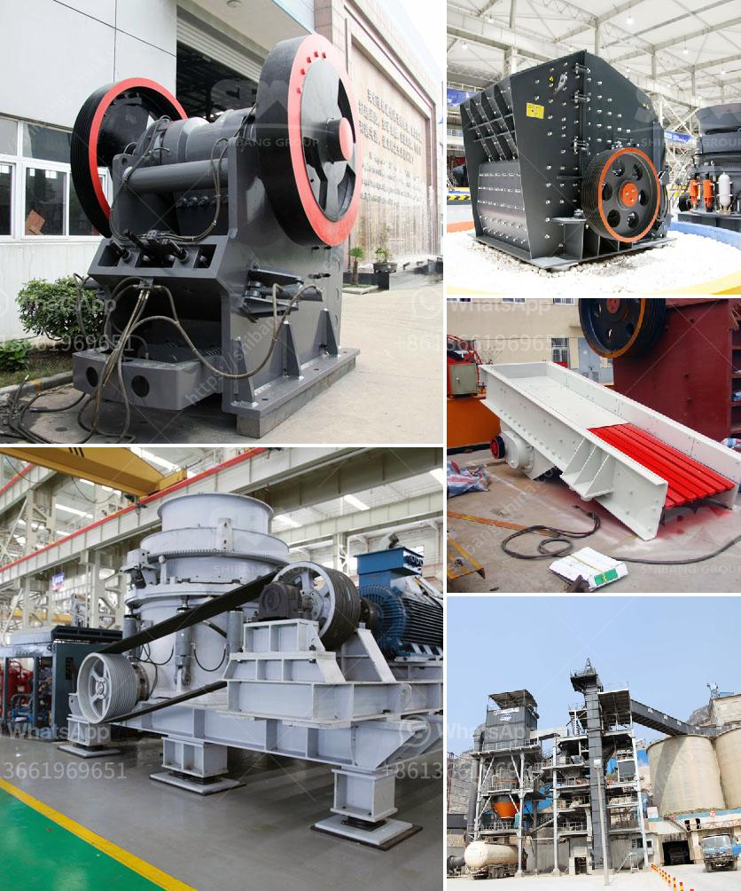

<h3>roll crusher reduction ratio</h3>
Roll crushers have a theoretical MAXIMUM reduction ratio of 4:1. If a 2-inch particle is fed to the roll crusher, the absolute smallest size one could expect from the crusher is 1/2 inch. Roll crushers can be considered compression type crushers, meaning that the material is squeezed between two rotating rolls. These rolls draw the ore into the gap between their rotating surfaces and crush the material, which happens when the feed material is pressed and pulled through the two rolls.

With a reduction ratio of up to 4:1, roll crushers typically provide a smaller product size compared to other types of crushing equipment, such as jaw and cone crushers. This means they can be used to produce a wide range of product sizes, ranging from 1/2 inch to a few microns in size.

The main advantage of roll crushers is their ability to produce a relatively uniform particle size distribution, with minimal fines generation. This is due to the crushing action between the rotating rolls, which breaks the particles predominantly by compression and to a lesser extent by impact. The uniformity in the product size makes roll crushers particularly suitable for producing aggregates for construction purposes, where precise product specification is required.

Roll crushers are often used in mining applications as a secondary or tertiary crushing stage. Depending on the requirements, the material can be fed in through the top and discharged through the bottom, or vice versa. Roll crushers are also commonly used in the production of coal and coke for the iron and steel industry.

In summary, the reduction ratio of a roll crusher is typically 4:1. It provides a narrow particle size distribution, making it suitable for producing a uniform product size. Roll crushers are commonly used in mining, construction, and coal processing industries for reducing materials to a smaller size for further processing.
<h3>Contact us</h3><ul><li><strong>Whatsapp:&nbsp;<a href="https://wa.me/8613661969651">+8613661969651</a></strong></li><li><a href="https://swt.shibang-china.com/?git&amp;zhl&amp;roll crusher reduction ratio"><strong>Online Service(chat now)</strong></a></li></ul><h3>Related</h3><ul><li><a href='hammer mill for sale in dubai.md'>hammer mill for sale in dubai</a></li><li><a href='sand making plant.md'>sand making plant</a></li><li><a href='crusher machine manufacturers in india.md'>crusher machine manufacturers in india</a></li><li><a href='feldspar crusher supplier.md'>feldspar crusher supplier</a></li><li><a href='gypsum board plant.md'>gypsum board plant</a></li></ul>