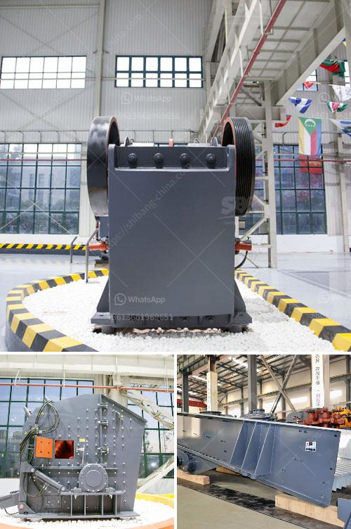

<h3>roll mill manufacturere in mumbai</h3>
Roll mill manufacturers in Mumbai are known for their high-quality products and efficient manufacturing processes. These manufacturers play a crucial role in the steel industry by providing state-of-the-art rolling mills that are used to produce various metal products.

The roll mill manufacturing industry in Mumbai is a highly competitive one, with several players vying for market dominance. Each manufacturer uses its unique technologies and techniques to produce rolling mills that meet the industry's stringent standards.

One of the key advantages of working with roll mill manufacturers in Mumbai is their expertise in designing and manufacturing rolling mills. These manufacturers have a deep understanding of the various processes involved in rolling metal, such as hot rolling, cold rolling, and ring rolling. They are well-versed in the latest technologies and industry trends, enabling them to stay ahead of the competition.

Roll mill manufacturers in Mumbai are also known for their commitment to quality. They adhere to strict quality control measures throughout the manufacturing process to ensure that their products meet the highest standards. This attention to detail and commitment to quality ensures that their rolling mills are durable, reliable, and capable of producing precise and consistent results.

Furthermore, roll mill manufacturers in Mumbai design their products with efficiency in mind. They strive to minimize energy consumption and optimize production rates, resulting in cost-effective and environmentally friendly manufacturing processes. By implementing efficient technologies and materials, these manufacturers can produce rolling mills that maximize productivity while minimizing waste.

Another significant advantage of working with roll mill manufacturers in Mumbai is their ability to provide custom solutions. They understand that each customer has unique requirements and specifications, and they are equipped to tailor their products accordingly. Whether customers need a rolling mill for a specific type of metal or have special design requests, these manufacturers can deliver customized solutions that meet their exact needs.

In addition to manufacturing high-quality rolling mills, these manufacturers also offer comprehensive after-sales services. They have dedicated service teams that provide installation, maintenance, and repair services to ensure that their customers' rolling mills continue to perform optimally over time. This commitment to customer satisfaction sets them apart from their competitors and helps build long-term relationships with their clients.

In conclusion, roll mill manufacturers in Mumbai are at the forefront of the steel industry, providing top-quality rolling mills that meet the industry's demanding standards. With their expertise, commitment to quality, efficiency, and customizability, these manufacturers are trusted partners for companies in need of reliable and high-performing rolling mills. Whether it is for hot rolling, cold rolling, or ring rolling, customers can rely on roll mill manufacturers in Mumbai to deliver state-of-the-art solutions that drive their success.
<h3>Contact us</h3><ul><li><strong>Whatsapp:&nbsp;<a href="https://wa.me/8613661969651">+8613661969651</a></strong></li><li><a href="https://swt.shibang-china.com/?git&amp;zhl&amp;roll mill manufacturere in mumbai"><strong>Online Service(chat now)</strong></a></li></ul><h3>Related</h3><ul><li><a href='plant grinder mill price.md'>plant grinder mill price</a></li><li><a href='how to make good with limestone powder.md'>how to make good with limestone powder</a></li><li><a href='mica powder mill equipment supplier.md'>mica powder mill equipment supplier</a></li><li><a href='stone crushing industry in malaysia.md'>stone crushing industry in malaysia</a></li><li><a href='process of preparing clay crusher.md'>process of preparing clay crusher</a></li></ul>