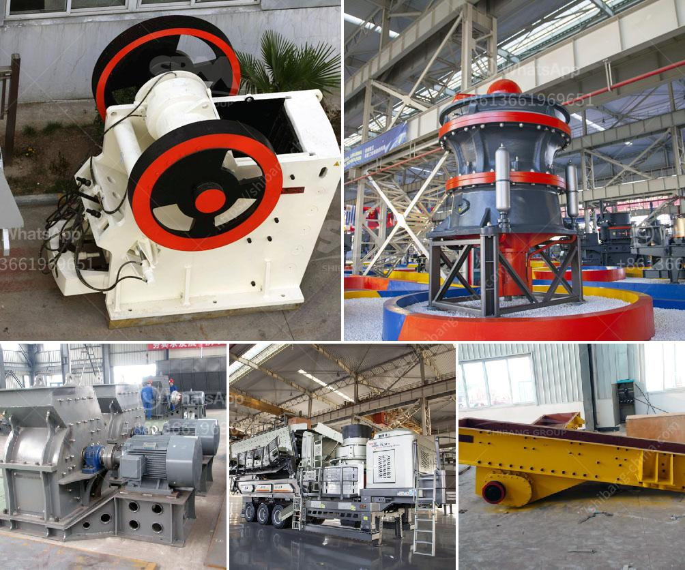

<h3>roller crusher brick making machine</h3>
In the world of construction, bricks have been an essential material for centuries. From small houses to large commercial buildings, bricks have reliably stood as a symbol of durability and strength. With advancements in technology, the method of brick making has also evolved, giving rise to roller crusher brick making machines.

The roller crusher brick making machine is an innovative machine that revolutionizes the traditional brick making process. It combines two machines in one, making brick production more efficient and cost-effective. The machine effectively reduces the size of clay, shale, or other raw materials, transforming them into small particles that can be further processed.

One of the most significant advantages of using a roller crusher brick making machine is its versatility. It can produce various types of bricks, including hollow bricks, perforated bricks, and solid bricks. This versatility allows manufacturers to meet the demands of different construction projects effectively.

Additionally, the roller crusher brick making machine offers greater convenience in operation. Its compact design and easy-to-use controls make it an ideal choice for both novice and experienced brick manufacturers. The machine requires minimal manual labor, reducing the chances of human errors and increasing productivity.

Another essential feature of the roller crusher brick making machine is its energy efficiency. Unlike traditional brick making methods, which consume a significant amount of energy, this machine utilizes modern technology to minimize energy consumption. As a result, manufacturers can reduce their carbon footprint and contribute to sustainable construction practices.

Moreover, the roller crusher brick making machine boasts a high production capacity. It can produce a larger quantity of bricks in a shorter period, meeting the growing demands of the construction industry. This increased productivity helps manufacturers meet project deadlines and maintain a competitive edge.

In conclusion, the roller crusher brick making machine marks a major breakthrough in brick production. It combines efficiency, versatility, and energy-saving features, making it an indispensable tool for brick manufacturers. With its ability to produce various types of bricks and its eco-friendly operation, it is undoubtedly a revolutionary innovation in the construction industry.
<h3>Contact us</h3><ul><li><strong>Whatsapp:&nbsp;<a href="https://wa.me/8613661969651">+8613661969651</a></strong></li><li><a href="https://swt.shibang-china.com/?git&amp;zhl&amp;roller crusher brick making machine"><strong>Online Service(chat now)</strong></a></li></ul><h3>Related</h3><ul><li><a href='crusher for sale in malaysia.md'>crusher for sale in malaysia</a></li><li><a href='ethiopia cone crusher for sale.md'>ethiopia cone crusher for sale</a></li><li><a href='pebble crushing processing.md'>pebble crushing processing</a></li><li><a href='looking for limestone crushing contractor.md'>looking for limestone crushing contractor</a></li><li><a href='granite crushing per tonne.md'>granite crushing per tonne</a></li></ul>