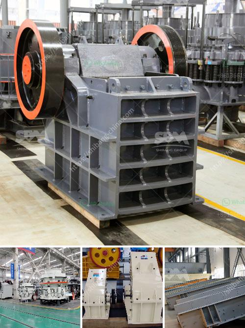

<h3>roller crusher mill for calcium carbonate</h3>
Calcium carbonate is a common material used in a wide range of applications, from pharmaceuticals to construction. Its primary use in industrial sectors is as a filler and coating agent. However, calcium carbonate powder can also be processed into a more effective and efficient form using roller crusher mill technology. This article explores the roller crusher mill and its benefits in calcium carbonate powder production.

Roller crushers are efficient grinding machines designed for heavy-duty applications. With roller crusher mills, the grinding material is fed between two rollers which rotate towards each other. The rollers compress the material, reducing its size and providing a consistent particle size with minimal fines. The process is simple and does not require any additional equipment, making it cost-effective and easy to operate.

One of the key advantages of roller crushers is their ability to process materials with high moisture content. The roller crusher mill technology guarantees minimal moisture loss during the grinding process, ensuring the final product retains its moisture content, which is critical in calcium carbonate applications. A roller crusher is ideal for calcium carbonate powders as it eliminates the need for additional drying equipment and reduces energy consumption.

In addition to processing calcium carbonate, roller crushers are increasingly being used for mineral and ore grinding. In recent years, with the increasing demands for finer and more precise particle sizes, the roller crusher mill technology has been extended to other mineral sands applications. Now, roller crushers are widely used for coal, potash, salts, lime, limestone, soft ores, friable materials, and industrial minerals.

Advancements in technology have led to the development of innovative roller crusher mills that enhance the operational efficiency and maximize the profitability of calcium carbonate grinding projects. These mills are equipped with advanced automation systems, including remote diagnostics, real-time monitoring, and predictive maintenance, enhancing operational control and reducing downtime. Manufacturers also provide comprehensive technical support to ensure smooth commissioning and ongoing support.

When choosing a roller crusher mill for calcium carbonate powder production, it is essential to consider the specific needs of your application, as well as the available space, equipment complexity, and budget. Manufacturers offer a wide range of roller crushers, each with different features and capabilities to suit various plant sizes and production requirements. Customization options are available to optimize performance and address specific challenges.

In conclusion, roller crusher mills offer a game-changing solution for calcium carbonate powder production. These machines eliminate the need for additional drying equipment, reduce energy consumption, and ensure the final product retains its moisture content. Roller crushers are also versatile machines that can be used for grinding various minerals and ores, making them a valuable asset in many industrial sectors. As technology continues to advance, roller crusher mills are expected to further evolve, providing even greater efficiency and productivity benefits.
<h3>Contact us</h3><ul><li><strong>Whatsapp:&nbsp;<a href="https://wa.me/8613661969651">+8613661969651</a></strong></li><li><a href="https://swt.shibang-china.com/?git&amp;zhl&amp;roller crusher mill for calcium carbonate"><strong>Online Service(chat now)</strong></a></li></ul><h3>Related</h3><ul><li><a href='spec for 200 tph crushing plant.md'>spec for 200 tph crushing plant</a></li><li><a href='jaw crusher for sale in harare.md'>jaw crusher for sale in harare</a></li><li><a href='marble quarry mining crusher in sudan.md'>marble quarry mining crusher in sudan</a></li><li><a href='non magnetic vibrating screen.md'>non magnetic vibrating screen</a></li><li><a href='stationary crushers and screens.md'>stationary crushers and screens</a></li></ul>