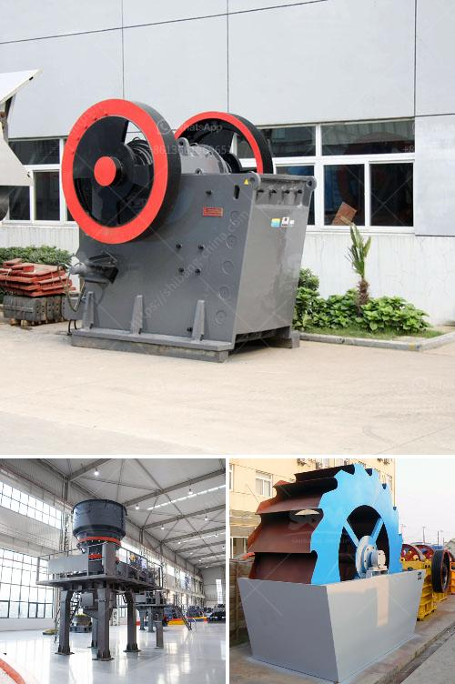

<h3>roller grinder mill manufacturers</h3>
Roller grinder mills are essential machinery used in various industries for grinding and pulverizing materials. These mills have been in use for several decades, and their popularity and utility continue to grow. As the demand for roller grinder mills increases, so does the need for reliable manufacturers who can deliver high-quality products. In this article, we will explore some of the top roller grinder mill manufacturers and highlight key aspects that make them stand out in the market.

One of the leading roller grinder mill manufacturers is XYZ Machinery. With a strong presence in the industry for over 30 years, XYZ Machinery has built a reputation for producing robust and efficient grinder mills. Their mills are known for their durability, precision, and low maintenance requirements. XYZ Machinery ensures that each grinder mill undergoes rigorous testing to ensure optimal performance, ensuring that their customers receive a reliable and superior product.

Another prominent roller grinder mill manufacturer is ABC Engineering. ABC Engineering is known for its innovative designs and cutting-edge technology. They are constantly investing in research and development to improve their mills' efficiency and performance. ABC Engineering mills are known for their smooth operation, low noise levels, and energy efficiency. They also provide excellent after-sales support, ensuring that their customers receive prompt assistance and maintenance services whenever required.

CDE Industry is a well-established player in the roller grinder mill market. Their mills are recognized for their high capacity and versatility. CDE Industry offers a wide range of grinder mills suitable for different materials and applications. Their mills are customizable to meet specific customer requirements, enabling clients to achieve maximum productivity with minimal wastage. CDE Industry also places great emphasis on customer satisfaction, providing comprehensive support throughout the entire purchasing and installation process.

In recent years, EcoTech Mills has emerged as a leading roller grinder mill manufacturer. EcoTech Mills specializes in producing environmentally friendly mills that reduce energy consumption and emissions. Their mills incorporate advanced technology to minimize carbon footprint without compromising performance. EcoTech Mills mills are also equipped with safety features to ensure the well-being of operators and meet the highest industry standards.

When choosing a roller grinder mill manufacturer, it is essential to consider factors such as quality, reliability, and customer support. These manufacturers, XYZ Machinery, ABC Engineering, CDE Industry, and EcoTech Mills, have established themselves as industry leaders by consistently delivering exceptional products and services. By opting for reputable manufacturers like these, customers can be assured of investing in durable and efficient mills that meet their specific needs.

In conclusion, roller grinder mills play a crucial role in various industries, and reliable manufacturers are essential to meet the growing demand for these machines. Companies like XYZ Machinery, ABC Engineering, CDE Industry, and EcoTech Mills have excelled in producing high-quality, efficient, and customizable grinder mills. By choosing a reputable manufacturer, users can benefit from superior performance, durability, and excellent customer support.
<h3>Contact us</h3><ul><li><strong>Whatsapp:&nbsp;<a href="https://wa.me/8613661969651">+8613661969651</a></strong></li><li><a href="https://swt.shibang-china.com/?git&amp;zhl&amp;roller grinder mill manufacturers"><strong>Online Service(chat now)</strong></a></li></ul><h3>Related</h3><ul><li><a href='equipment needed for small scale mining in zimbabwe.md'>equipment needed for small scale mining in zimbabwe</a></li><li><a href='clay beneficiation process.md'>clay beneficiation process</a></li><li><a href='operating parameter of vertical roller mill.md'>operating parameter of vertical roller mill</a></li><li><a href='quotation for crushing and screening.md'>quotation for crushing and screening</a></li><li><a href='china limestone jaw crusher machine.md'>china limestone jaw crusher machine</a></li></ul>