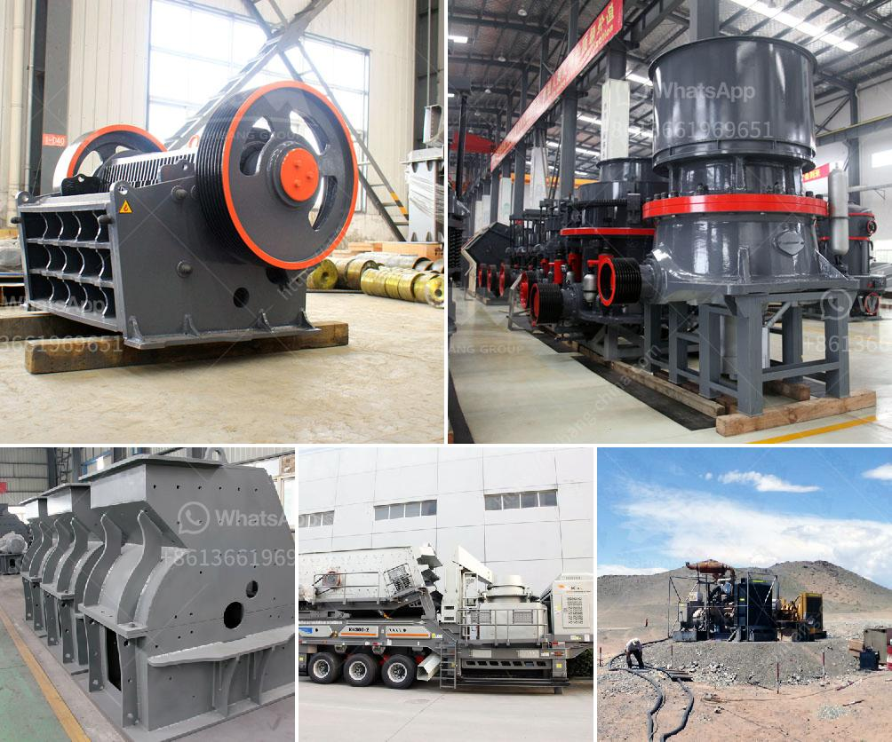

<h3>roller grinding mill vibration</h3>
Roller grinding mills are extensively used in various industries such as mining and construction for size reduction of various materials. However, excessive vibration during operation can cause significant disruptions, resulting in decreased production efficiency and increased maintenance costs. Understanding the causes of vibration and implementing appropriate solutions is essential for smooth and efficient mill operation.

One of the primary causes of vibration in roller grinding mills is poor installation or maintenance. Improper alignment of various machine components, such as the grinding rollers and bearings, can result in excessive vibration and premature wear. Similarly, worn-out or damaged parts, such as damaged bearing housings or misaligned gears, can also contribute to increased vibration levels. Regular inspections and proper maintenance practices should be implemented to address these issues and ensure the smooth operation of the mill.

Another common cause of vibration is the uneven distribution of material on the grinding table. If the material is not evenly distributed across the entire grinding surface, it can lead to imbalanced forces and vibrations. This is especially important when dealing with materials of varying densities and particle sizes. Careful monitoring of the material feed rate and adjusting the distribution accordingly can help minimize this problem.

Wear and tear on various components can also lead to vibration in roller grinding mills. Over time, the grinding rollers and rings can become worn, resulting in an uneven grinding surface and increased vibration. Similarly, worn-out or damaged bearings can cause imbalanced forces, leading to excessive vibrations. Regular inspection and replacement of these components are necessary to avoid further damage and maintain stable mill operation.

In some cases, the materials being ground themselves can lead to significant vibrations. If the materials are highly abrasive or contain hard particles, they can cause accelerated wear on the grinding surfaces. As these wear surfaces become uneven and damaged, vibrations can occur. Choosing the appropriate grinding media and adjusting the operating parameters of the mill, such as feed rate and grinding pressure, can help mitigate this issue.

Fortunately, there are several solutions available to address vibration in roller grinding mills. First and foremost, regular maintenance practices should be followed, including proper machine lubrication and alignment. Timely replacement of worn components, such as grinding rollers, rings, and bearings, is also crucial to maintain smooth operation. In addition, implementing a comprehensive monitoring system that continuously assesses vibration levels can help identify potential issues before they become significant problems.

In conclusion, dealing with vibration in roller grinding mills is crucial for maintaining efficient and uninterrupted operation. Understanding the causes of vibration and implementing appropriate solutions such as proper installation, regular maintenance, and monitoring can help minimize disruptions and prolong the lifespan of the mill. By proactively addressing vibration issues, industries can enhance productivity and reduce downtime, resulting in improved overall performance.
<h3>Contact us</h3><ul><li><strong>Whatsapp:&nbsp;<a href="https://wa.me/8613661969651">+8613661969651</a></strong></li><li><a href="https://swt.shibang-china.com/?git&amp;zhl&amp;roller grinding mill vibration"><strong>Online Service(chat now)</strong></a></li></ul><h3>Related</h3><ul><li><a href='small slag crushing plant manufacturers in delhi.md'>small slag crushing plant manufacturers in delhi</a></li><li><a href='vertical mill working principle of the hydraulic.md'>vertical mill working principle of the hydraulic</a></li><li><a href='ballast making machine for sale.md'>ballast making machine for sale</a></li><li><a href='china roller grinding mill.md'>china roller grinding mill</a></li><li><a href='coal processing plants for sale.md'>coal processing plants for sale</a></li></ul>