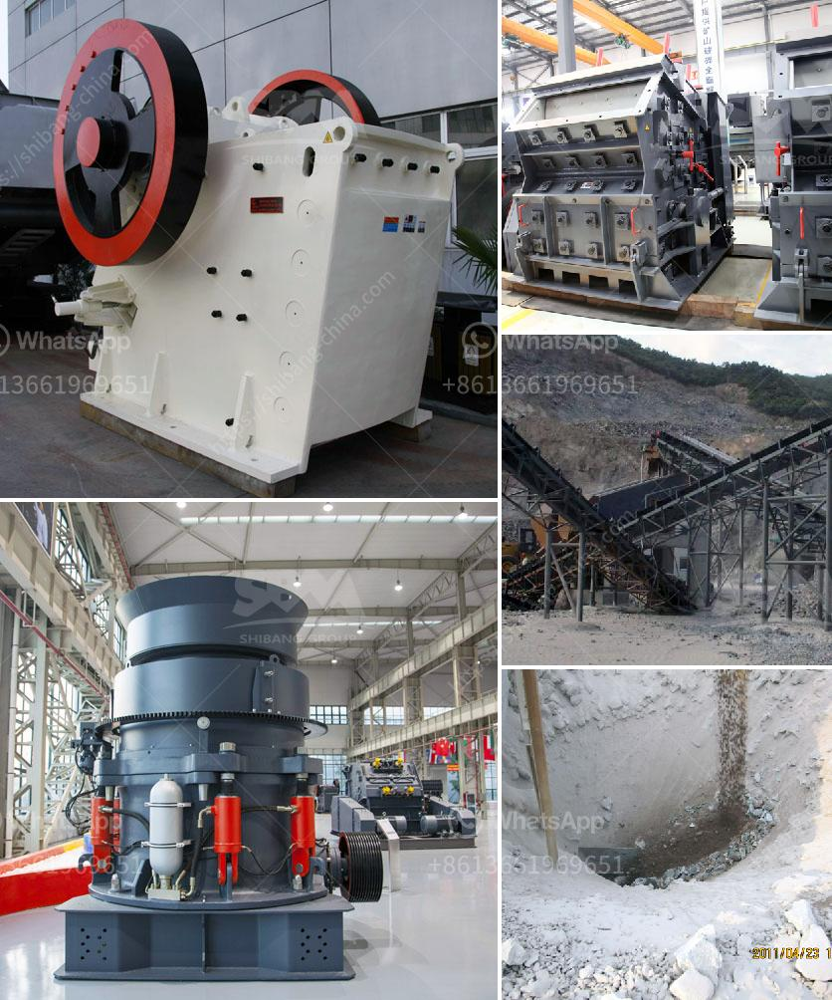

<h3>roller mill calcium</h3>
Calcium carbonate, a ubiquitous compound found in various forms, plays a vital role in multiple industries such as construction, pharmaceuticals, agriculture, and more. Whether it is utilized as a key ingredient in cement production, as a dietary supplement, or as a filler in paper and plastics, the quality and efficiency of calcium carbonate manufacturing processes significantly impact the final product. In this regard, the roller mill calcium, a specialized machine for grinding and processing calcium carbonate, has emerged as a game-changer.

The roller mill calcium, also known as the vertical roller mill, has revolutionized the grinding industry by providing a smooth and efficient grinding process. This advanced mill employs a unique vertical roller system that grinds calcium carbonate materials into a fine powder with high accuracy and uniformity. Unlike traditional grinding techniques, the roller mill ensures consistent particle size reduction, resulting in enhanced quality and increased efficiency.

One of the key advantages of the roller mill calcium lies in its ability to deliver a fine and precise grinding experience. The mill operates by passing the calcium carbonate material between two heavy-duty rollers, crushing it into smaller particles. Unlike traditional mills that rely on centrifugal forces, the roller mill utilizes the energy generated by the roller's rotation, ensuring gentle yet effective grinding action. Consequently, this method prevents excessive heat generation and allows for the preservation of the material's integrity and original properties.

In addition to its unparalleled grinding capabilities, the roller mill calcium streamlines the manufacturing process, offering multiple benefits for businesses. Firstly, the mill's compact design allows for space-efficient installation, making it suitable for both large-scale industrial operations and smaller workshops. The user-friendly interface and automatic control system further simplify operation, reducing the need for manual intervention and increasing overall production efficiency.

Moreover, the roller mill calcium offers remarkable versatility in material processing. Whether the end product requires fine or coarse grinding, the mill accommodates various feed sizes and provides precise control over the desired particle size distribution. Manufacturers can thus achieve consistent quality across different product batches, ensuring customer satisfaction and maintaining a competitive edge in the market.

Another aspect worth noting is the roller mill calcium's energy efficiency. Traditional grinding techniques often result in significant energy losses due to heat generation and excessive power consumption. In contrast, the roller mill operates on a low-energy principle, minimizing energy wastage and reducing operational costs. As sustainability becomes increasingly important in today's manufacturing landscape, this feature positions the roller mill as an eco-friendly and cost-effective choice.

In conclusion, the roller mill calcium emerges as an essential tool for grinding and processing calcium carbonate in various industries. Its unique vertical roller system ensures a precise and consistent grinding experience, improving the quality and efficiency of manufacturing processes. With its compact design, user-friendly interface, and energy efficiency, the roller mill calcium offers considerable advantages to businesses seeking to enhance productivity, reduce costs, and produce high-quality calcium carbonate products.
<h3>Contact us</h3><ul><li><strong>Whatsapp:&nbsp;<a href="https://wa.me/8613661969651">+8613661969651</a></strong></li><li><a href="https://swt.shibang-china.com/?git&amp;zhl&amp;roller mill calcium"><strong>Online Service(chat now)</strong></a></li></ul><h3>Related</h3><ul><li><a href='chrome ore beneficiation plant in china.md'>chrome ore beneficiation plant in china</a></li><li><a href='rubble crushers for sale.md'>rubble crushers for sale</a></li><li><a href='crusher machine manufacturers in pakistan.md'>crusher machine manufacturers in pakistan</a></li><li><a href='uses of stone crusher equipment pdf.md'>uses of stone crusher equipment pdf</a></li><li><a href='gypsum board plant.md'>gypsum board plant</a></li></ul>