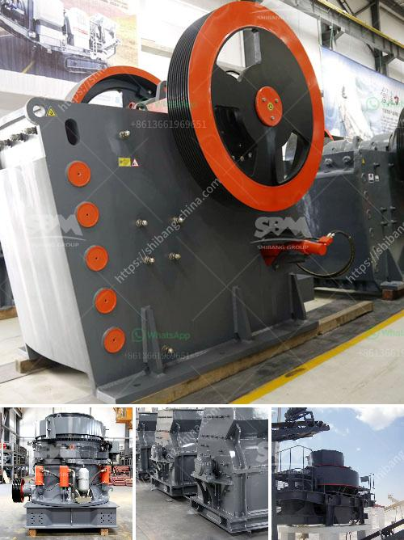

<h3>roller mill diagram</h3>
A roller mill is a piece of heavy-duty machinery used to crush or grind objects like wheat or corn into smaller pieces. Unlike traditional milling techniques that rely on stones or discs to crush material, roller mills use cylindrical rollers to crush and grind material. The roller mill diagram shows the mechanisms involved in the process.

The diagram illustrates a roller mill, also known as a grinding mill. It consists of a pair of cylindrical rollers, which are mounted horizontally on a frame. The rollers rotate in opposite directions, causing the material to be crushed, ground, and refined.

The roller mill diagram includes components such as the feed hopper, the material inlet chute, the air intake, the grinding chamber, the discharge outlet, the drive motor, and the control panel. The material to be ground enters the hopper and falls onto the rollers through the inlet chute. As the rollers rotate, the grain or material is crushed and passes through the grinding chamber.

The grinding chamber is where the actual grinding or milling process takes place. The material is crushed by the pressure exerted by the rollers. The grinding action is made possible by the spacing between the rollers, which can be adjusted to control the fineness of the final product. The discharge outlet is where the ground material exits the roller mill.

The roller mill diagram depicts the airflow inside the mill. Air is drawn into the mill through the air intake, which creates a cooling effect on the rollers and the ground material. This helps to prevent overheating and ensure efficient grinding. The air also helps to carry the ground material out of the mill.

Roller mills are widely used in various industries such as agriculture, food processing, and mining. They offer several advantages over traditional milling techniques, including higher productivity, enhanced grinding efficiency, and improved product quality. Roller mills are also more versatile and can handle a wide range of materials, from grains to minerals.

In conclusion, a roller mill diagram provides a visual representation of the workings of a roller mill. Understanding the components and mechanisms involved in roller milling can help to appreciate its efficiency and versatility in various industries. Roller mills continue to be a popular choice for processing and refining various materials, contributing to the advancement of various sectors.
<h3>Contact us</h3><ul><li><strong>Whatsapp:&nbsp;<a href="https://wa.me/8613661969651">+8613661969651</a></strong></li><li><a href="https://swt.shibang-china.com/?git&amp;zhl&amp;roller mill diagram"><strong>Online Service(chat now)</strong></a></li></ul><h3>Related</h3><ul><li><a href='companies that sell conveyor belts.md'>companies that sell conveyor belts</a></li><li><a href='crusher plant for sale china.md'>crusher plant for sale china</a></li><li><a href='cocoa processing plant in nigeria.md'>cocoa processing plant in nigeria</a></li><li><a href='portable stone crusher.md'>portable stone crusher</a></li><li><a href='vertical mill rock.md'>vertical mill rock</a></li></ul>