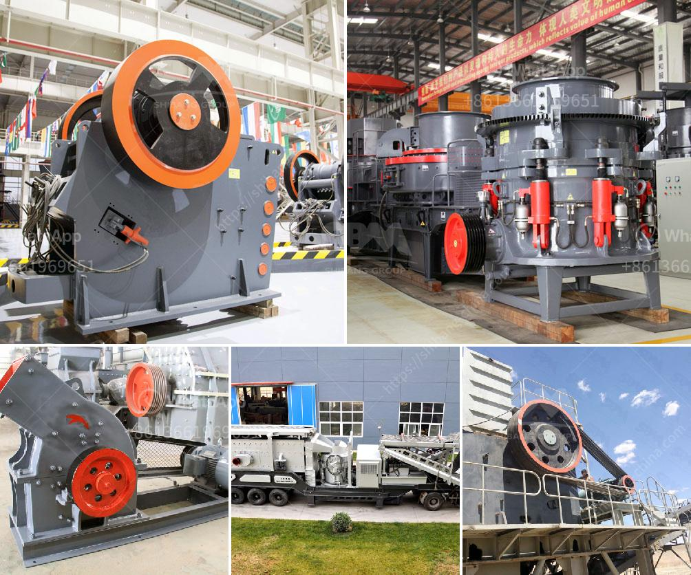

<h3>roller mill for gravel</h3>
Gravel is a fundamental material in the construction industry, used for various purposes such as making concrete, filling drainage systems, and landscaping. To meet the increasing demand for gravel, it is essential to have a reliable and efficient method of processing raw materials. The roller mill has emerged as a game-changer in this regard, providing an exceptional solution for gravel production.

A roller mill is a machine that grinds materials into fine powders or particles using cylindrical rollers. These rollers rotate rapidly, exerting force and pressure on the raw materials, effectively crushing and grinding them into desired sizes. In the case of gravel, a roller mill can crush larger stones into smaller fragments, creating gravel that meets specific requirements.

One of the key advantages of using a roller mill for gravel processing is its efficiency. With its high-speed rotation and multiple crushing and grinding stages, a roller mill can process a large volume of gravel in a relatively short time. This not only increases productivity but also helps meet tight project deadlines and customer demands.

The roller mill also offers an advantage in terms of the quality of the gravel produced. By crushing and grinding the raw materials evenly, a roller mill ensures consistent particle size distribution, resulting in uniformly sized and shaped gravel. This is particularly important, as gravel with inconsistent sizes can affect the structural integrity of construction projects and compromise their overall quality.

Furthermore, a roller mill allows for precise control over the particle size of the gravel produced. By adjusting the gap between the rollers or using different types of rollers, operators can achieve the desired size distribution, catering to specific project requirements. This flexibility and control contribute to the versatility of a roller mill in gravel production.

In addition to efficiency and quality, a roller mill offers other remarkable features that enhance its appeal for gravel processing. For instance, many roller mills are designed with robust construction materials and advanced technologies, ensuring their durability and longevity even in harsh operating conditions. They are also equipped with safety mechanisms and controls to protect operators and prevent accidents.

Moreover, roller mills are often designed with low maintenance requirements, reducing downtime and overall operating costs. Most models also offer easy access to internal components, simplifying maintenance and repairs. These advantages make a roller mill a cost-effective investment for gravel producers, ensuring a steady supply of high-quality gravel without compromising financial viability.

It is worth noting that the versatile nature of roller mills allows them to process a wide range of materials in addition to gravel, such as ores, minerals, and chemicals. This adds value to a roller mill, making it a valuable asset in various industries beyond gravel production.

In conclusion, the roller mill has revolutionized the gravel production process, offering efficiency, quality, and flexibility in meeting the demands of the construction industry. Its ability to crush and grind raw materials into fine particles with precise control over particle size distribution makes it a superior choice for gravel processing. As the demand for gravel continues to rise, investing in a roller mill becomes an indispensable move for gravel producers looking to enhance their operations.
<h3>Contact us</h3><ul><li><strong>Whatsapp:&nbsp;<a href="https://wa.me/8613661969651">+8613661969651</a></strong></li><li><a href="https://swt.shibang-china.com/?git&amp;zhl&amp;roller mill for gravel"><strong>Online Service(chat now)</strong></a></li></ul><h3>Related</h3><ul><li><a href='pe jaw crusher stone jaw crusher for rock crushing.md'>pe jaw crusher stone jaw crusher for rock crushing</a></li><li><a href='crushers and screeners for hire in usa.md'>crushers and screeners for hire in usa</a></li><li><a href='vertical mill rock.md'>vertical mill rock</a></li><li><a href='jaw crusher buy in ukraine.md'>jaw crusher buy in ukraine</a></li><li><a href='impact crusher machine for sale.md'>impact crusher machine for sale</a></li></ul>