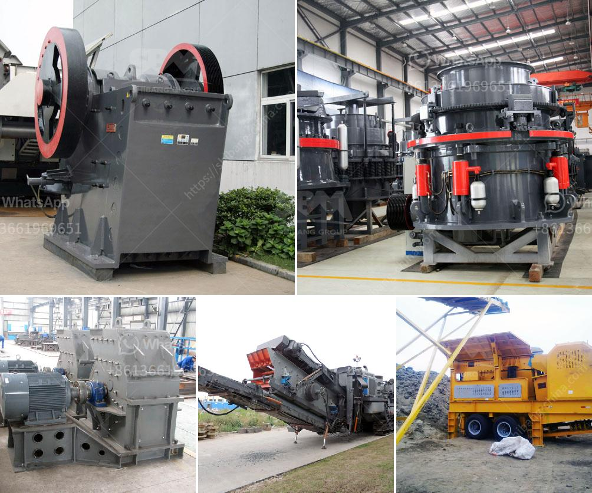

<h3>roller mill for sale nz</h3>
Are you in the market for a roller mill? Look no further than the diverse and innovative roller mill options available for sale in New Zealand. Roller mills, also known as grain mills, are an essential piece of equipment for many industries, including agriculture, brewing, and food processing. These machines efficiently process and grind grains to produce various products such as flour, animal feed, and beer. With a wide range of roller mills available for sale in New Zealand, you can find the perfect machine to suit your needs and enhance your productivity.

One of the main advantages of roller mills is their ability to produce consistent and uniform results. Unlike traditional stone mills, roller mills crush and grind grains using pairs of rotating rollers. The adjustable gap between the rollers allows for precise control over the final grind size, ensuring consistent quality output with every batch. This consistency is crucial for industries that rely on uniform particle size distribution, such as flour production or animal feed manufacturing.

In addition to consistency, roller mills also offer high efficiency and throughput. The roller milling process is fast and effective, allowing you to process high volumes of grains quickly. This can be particularly beneficial for large-scale operations where time is of the essence. Moreover, roller mills are designed with durable materials and require minimal maintenance, reducing downtime and maximizing productivity.

When searching for a roller mill for sale in New Zealand, there are various factors to consider. First and foremost, it is essential to determine your specific needs and requirements. Consider the type and quantity of grains you will be processing, as well as your desired output and production volume. This information will help you choose a roller mill that can meet your expectations and optimize your operations.

Additionally, it is crucial to select a roller mill from a reputable supplier. Look for companies that have a proven track record in the industry and offer reliable and high-quality machines. Consider factors such as warranty, after-sales service, and technical support when making your decision. It is also advisable to compare prices and specifications from different suppliers to ensure you are getting the best value for your investment.

Lastly, always ensure that the roller mill you choose complies with industry standards and regulations. Safety should be a top priority when working with any machinery, and roller mills are no exception. Look for models that are designed with safety features and follow proper operating procedures to prevent accidents or injuries.

In conclusion, roller mills offer numerous benefits for industries involved in grain processing. Their consistency, efficiency, and high throughput make them an ideal choice for businesses in New Zealand. When looking for a roller mill for sale, consider your specific needs, choose a reputable supplier, and prioritize safety. With the right roller mill, you can enhance your productivity and ensure consistent quality in your grain processing operations.
<h3>Contact us</h3><ul><li><strong>Whatsapp:&nbsp;<a href="https://wa.me/8613661969651">+8613661969651</a></strong></li><li><a href="https://swt.shibang-china.com/?git&amp;zhl&amp;roller mill for sale nz"><strong>Online Service(chat now)</strong></a></li></ul><h3>Related</h3><ul><li><a href='jaw crusher size and capacity.md'>jaw crusher size and capacity</a></li><li><a href='ball mill iron ore only company.md'>ball mill iron ore only company</a></li><li><a href='ball mill 3 ton.md'>ball mill 3 ton</a></li><li><a href='limestone powder mill.md'>limestone powder mill</a></li><li><a href='chrome ore beneficiation plant in china.md'>chrome ore beneficiation plant in china</a></li></ul>