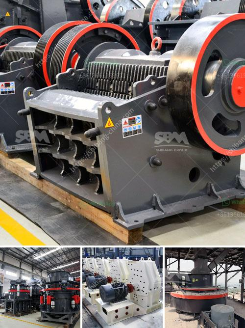

<h3>rolling mill raw material</h3>
The rolling mill is a crucial piece of equipment used in the metal industry for various purposes such as shaping, reducing the thickness, and enhancing the physical properties of metal products. However, one aspect that often goes unnoticed is the raw material used in the rolling mill. Raw material plays a vital role in determining the quality, strength, and durability of the final product. In this article, we will explore the importance of raw material selection for the rolling mill and its impact on the metal industry.

Raw material for the rolling mill can vary depending on the specific application and industry requirements. Generally, metals such as steel, aluminum, and copper are commonly used as raw materials in the rolling mill. However, the quality and composition of these raw materials significantly affect the end product's quality. It is essential to carefully select the raw material to ensure consistency, reliability, and desired physical properties in the finished product.

One critical factor to consider when selecting raw material for the rolling mill is its chemical composition. Different alloys and elements present in the raw material contribute to its strength, flexibility, and corrosion resistance. For instance, the addition of carbon content in steel enhances its tensile strength, hardness, and wear resistance. Similarly, the addition of specific alloys such as copper and magnesium to aluminum can improve its strength and heat resistance.

Aside from composition, the physical properties of the raw material also hold significant importance in the rolling mill process. The homogeneity, cleanliness, and formability of the raw material directly impact the rolling mill's efficiency and the quality of the final product. Contaminants, impurities, and segregations in the raw material can lead to defects, surface irregularities, and weakening of the end product. Therefore, it is crucial to source raw materials from reputable suppliers who adhere to stringent quality control measures.

The size, shape, and dimension of the raw material also affect the rolling mill process. Irregularities in the raw material can disrupt the uniformity and consistency required for the rolling mill's smooth operation. Therefore, raw materials must undergo rigorous testing, inspection, and preprocessing, such as shearing, cutting, or milling, to ensure they meet the desired specifications and standards.

Moreover, the raw material's cost and availability are important considerations for any rolling mill operation. As the metal industry is highly competitive, organizations strive for cost-effective solutions without compromising the product's quality. Sourcing raw materials from reliable suppliers and optimizing the inventory management process can help minimize cost while meeting production demands.

In conclusion, raw material selection for the rolling mill is a critical aspect of ensuring superior quality, strength, and durability in the metal industry. By carefully considering the chemical composition, physical properties, and formability of the raw materials, manufacturers can guarantee consistent and reliable performance of their rolling mills. Consequently, this enhances the product's quality, reduces defects, and improves the overall efficiency of the rolling mill operations. As the metal industry continues to evolve and demand for high-quality products increases, selecting the right raw material becomes even more crucial for the success of the rolling mill processes.
<h3>Contact us</h3><ul><li><strong>Whatsapp:&nbsp;<a href="https://wa.me/8613661969651">+8613661969651</a></strong></li><li><a href="https://swt.shibang-china.com/?git&amp;zhl&amp;rolling mill raw material"><strong>Online Service(chat now)</strong></a></li></ul><h3>Related</h3><ul><li><a href='gypsum powder making.md'>gypsum powder making</a></li><li><a href='mobile ball mill for small scale mining.md'>mobile ball mill for small scale mining</a></li><li><a href='stone crusher machine for rent or lease india.md'>stone crusher machine for rent or lease india</a></li><li><a href='suppliers chrome mining equipment in zimbabwe.md'>suppliers chrome mining equipment in zimbabwe</a></li><li><a href='ultra fine mill price.md'>ultra fine mill price</a></li></ul>