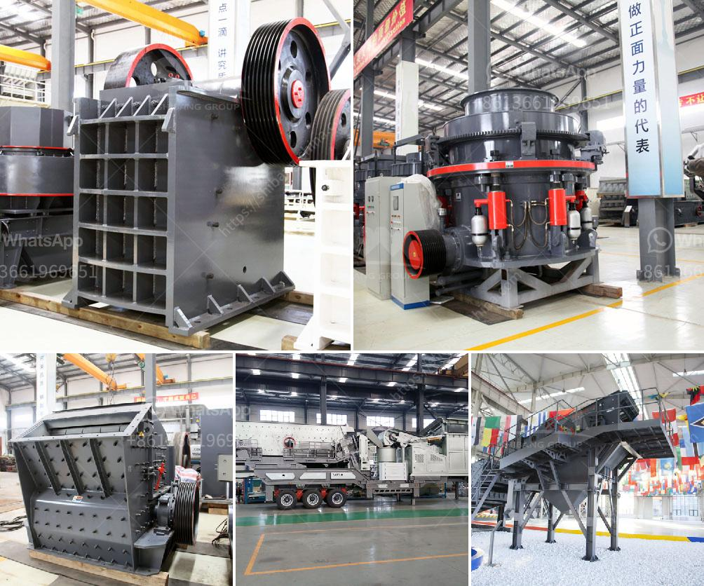

<h3>rubber conveyor belt pdf</h3>
A rubber conveyor belt PDF is a helpful utility that automates the movement of materials in diverse industrial sectors. These belts are fabricated from rubberized materials that are reinforced with textile or metal cords. The rubber conveyor belt PDF is widely used in metallurgical, coal mining, power plant, ports, building materials, chemical, and other industries. The increasing demand for rubber conveyor belts contributes positively to the growth of the industry worldwide.

One of the significant advantages of using a rubber conveyor belt PDF is its durability. These belts are designed to withstand extreme temperatures, heavy loads, and high-speed applications. The rubber materials used provide excellent resistance to abrasion, impact, and degradation, ensuring a longer lifespan of the belt. This feature makes rubber conveyor belts ideal for conveying a wide range of materials such as ores, coal, rocks, grains, and other bulk products.

Another key benefit of rubber conveyor belts is their versatility and adaptability to various conveyor systems. Whether it is a straight line, curved, or inclined conveyor, rubber belts can be customized to fit any configuration. This flexibility enhances overall operational efficiency, allowing for seamless transportation and movement of materials within the industrial environment.

Furthermore, rubber conveyor belts require minimal maintenance, which reduces downtime and increases productivity. Routine inspections and simple cleaning procedures ensure that the belts remain in optimal condition, ensuring uninterrupted material flow. The robust construction of rubber conveyor belts limits the need for frequent replacements and repairs, resulting in significant cost savings for businesses.

Safety is a paramount concern in any industrial setting, and rubber conveyor belts are designed with various safety measures in place. The anti-static properties of rubber belts prevent the accumulation of static electricity, minimizing the risk of fire and explosion in potentially hazardous environments. Additionally, the textured surface of the rubber belt prevents slipping and provides high gripping power during material transportation, ensuring worker safety and preventing material spillage.

The rubber conveyor belt PDF also offers environmental benefits. Unlike other materials, rubber is eco-friendly and can be easily recycled, reducing waste and carbon emissions. Many manufacturers are increasingly incorporating sustainable practices in the production of rubber conveyor belts to contribute to a greener future.

In conclusion, a rubber conveyor belt PDF is a versatile and reliable solution for effective material handling in various industries. Its robust construction, durability, and adaptability make it an essential component in any conveyor system. The ease of maintenance and enhanced safety features complement its functionality, resulting in improved operational efficiency and reduced downtime. Moreover, the eco-friendly nature of rubber belts aligns with the growing importance of sustainable practices. As the demand for efficient material handling continues to rise, the rubber conveyor belt PDF remains an uncompromising choice for businesses looking to optimize their operations.
<h3>Contact us</h3><ul><li><strong>Whatsapp:&nbsp;<a href="https://wa.me/8613661969651">+8613661969651</a></strong></li><li><a href="https://swt.shibang-china.com/?git&amp;zhl&amp;rubber conveyor belt pdf"><strong>Online Service(chat now)</strong></a></li></ul><h3>Related</h3><ul><li><a href='ball mill for size reduct.md'>ball mill for size reduct</a></li><li><a href='limestone needed for 1 ton cement production.md'>limestone needed for 1 ton cement production</a></li><li><a href='rock crushing machine price in india.md'>rock crushing machine price in india</a></li><li><a href='ball mill small for sale.md'>ball mill small for sale</a></li><li><a href='concrete batching plant for sale in pakistan.md'>concrete batching plant for sale in pakistan</a></li></ul>