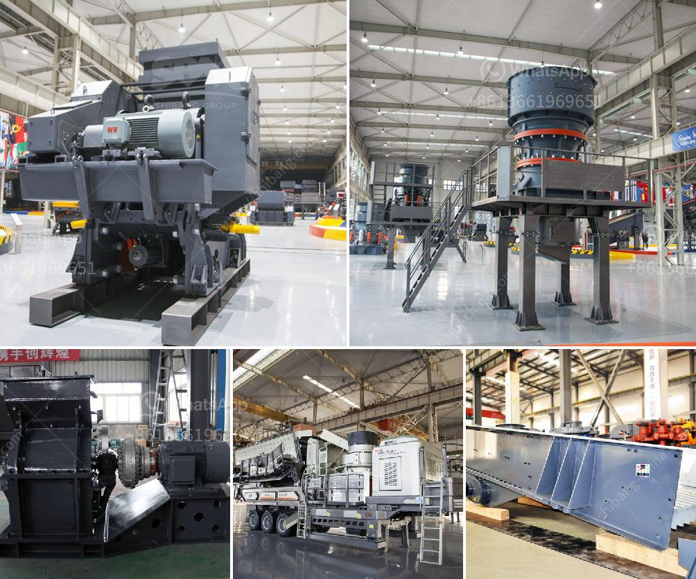

<h3>rubber grinder machine in philippines</h3>
The Philippines has a vast and abundant supply of natural rubber. This valuable renewable resource needs to be properly managed and recycled to minimize environmental impact and maximize its potential benefits. One essential tool in rubber recycling is the rubber grinder machine.

Rubber grinder machines play a crucial role in the rubber recycling process. They shred used or waste rubber materials into smaller pieces, reducing their size and facilitating other recycling processes such as granulation or melting. These machines are commonly used in the production of rubber powders and crumb rubber, which can then be utilized in various industries.

Rubber grinder machines in the Philippines are designed to grind rubber wastes into fine particles or powder to be reprocessed for recycling purposes. These machines are a great alternative to the traditional methods of rubber disposal, which often involve burning or burying, causing harm to the environment.

The rubber grinder machine efficiently transforms rubber scraps into useful materials, making them valuable commodities rather than waste. These recycled rubber products can be used in various industries such as construction, agriculture, automotive, and many more. For example, recycled rubber powders can be used in asphalt binders to improve road pavement, reduce noise, and enhance skid resistance. Recycled rubber crumbs can be molded into rubber mats or mixed with other materials to create durable flooring or rubberized playground surfaces.

In addition to promoting sustainability and minimizing waste, the rubber grinder machine also offers economic benefits. The recycling industry is a growing sector that provides employment opportunities and can contribute to the economy. Investing in a rubber grinder machine can be a wise decision for businesses or entrepreneurs looking to venture into rubber recycling.

In conclusion, a rubber grinder machine is a significant asset to the rubber recycling industry in the Philippines. It offers an efficient and eco-friendly solution to process and transform rubber waste into valuable materials. With its numerous applications and economic benefits, this machine proves to be a must-have for anyone involved in rubber recycling. By embracing the use of rubber grinder machines, the Philippines can maximize the potential of its rubber resources, contribute to environmental sustainability, and create a more prosperous future.
<h3>Contact us</h3><ul><li><strong>Whatsapp:&nbsp;<a href="https://wa.me/8613661969651">+8613661969651</a></strong></li><li><a href="https://swt.shibang-china.com/?git&amp;zhl&amp;rubber grinder machine in philippines"><strong>Online Service(chat now)</strong></a></li></ul><h3>Related</h3><ul><li><a href='salvage value of crusher machine.md'>salvage value of crusher machine</a></li><li><a href='mobile crusher machine for sale.md'>mobile crusher machine for sale</a></li><li><a href='cement production equipment in germany.md'>cement production equipment in germany</a></li><li><a href='types of crusher for ore processing.md'>types of crusher for ore processing</a></li><li><a href='4 rolar raymond mill productions.md'>4 rolar raymond mill productions</a></li></ul>