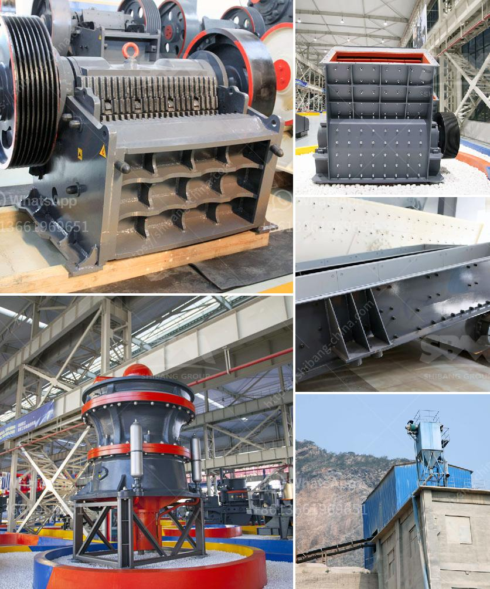

<h3>rubble crushers for sale</h3>
In today's world, sustainable practices are becoming increasingly important, and the construction industry is no exception. One area where significant progress is being made is in the recycling of construction waste, particularly rubble. Rubble crushers play a crucial role in enabling the reuse of these materials, by turning waste into valuable resources.

Rubble, which includes concrete, bricks, and other construction materials, is often discarded as waste. However, with advances in technology, rubble crushers have emerged as a practical solution for recycling these materials. These crushers are designed to break down the rubble into smaller, reusable particles, allowing it to be utilized for various purposes.

One of the key advantages of rubble crushers is their flexibility. They are available in various sizes and configurations, allowing contractors to choose the most suitable model for their specific needs. Whether it is a small-scale project or a large construction site, there is a rubble crusher that can handle the workload.

Another benefit of rubble crushers is their efficiency. These machines are designed to process large quantities of rubble quickly and efficiently. This means that contractors can save time and reduce the cost associated with waste disposal. By crushing the rubble on-site, the need for transporting it to a landfill is eliminated, further reducing the carbon footprint of the project.

Furthermore, rubble crushers offer a range of output sizes, depending on the specific requirements of the project. For example, crushed concrete can be used as a base material for new construction projects, while crushed brick can be utilized as a decorative element or as a substitute for gravel. The versatility of rubble crushers allows for the creation of various useful materials from construction waste.

In addition to the environmental and economic benefits, rubble crushers also contribute to improved safety on construction sites. By crushing the rubble on-site, the risk of accidents and injuries associated with the transportation of waste to landfills is minimized. Moreover, the use of rubble crushers reduces the need for manual labor, resulting in a safer working environment for site workers.

When considering the purchase of a rubble crusher, there are various factors to take into account. First and foremost, it is important to choose a reputable manufacturer known for producing high-quality machines. Additionally, the size and capacity of the crusher should align with the specific needs of the project. Other factors to consider include maintenance requirements, power source, and ease of operation.

Fortunately, there are a plethora of rubble crushers for sale on the market, offering contractors a wide range of options to choose from. By doing thorough research, comparing different models, and seeking recommendations, contractors can find the perfect crusher for their projects.

In conclusion, rubble crushers have revolutionized the recycling of construction waste by allowing contractors to turn waste into valuable materials. These crushers are flexible, efficient, and versatile, making them an essential tool for the modern construction site. Investing in a high-quality rubble crusher can not only save time and money but also contribute to a sustainable future.
<h3>Contact us</h3><ul><li><strong>Whatsapp:&nbsp;<a href="https://wa.me/8613661969651">+8613661969651</a></strong></li><li><a href="https://swt.shibang-china.com/?git&amp;zhl&amp;rubble crushers for sale"><strong>Online Service(chat now)</strong></a></li></ul><h3>Related</h3><ul><li><a href='crushed limestone for sale.md'>crushed limestone for sale</a></li><li><a href='fortius roller mill.md'>fortius roller mill</a></li><li><a href='2nd hand old mining process plant.md'>2nd hand old mining process plant</a></li><li><a href='used mobile screens and crusher in africa.md'>used mobile screens and crusher in africa</a></li><li><a href='hammer mill clay.md'>hammer mill clay</a></li></ul>