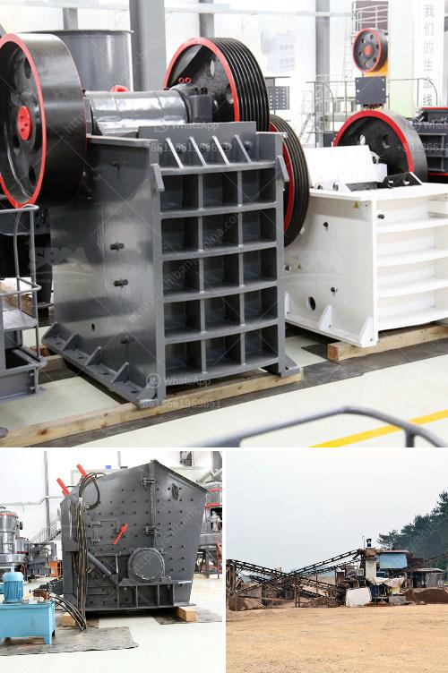

<h3>runner crusher china price</h3>
Runner crushers, also known as slalom crushers or ice breakers, have become an essential tool for construction and demolition projects in China. These powerful and versatile machines are used to demolish and crush concrete structures, making it easier to clear the site and recycle the debris.

One of the key factors to consider when purchasing a runner crusher is the price. With the growing demand for these machines in the Chinese market, there are various price ranges available, ranging from affordable to high-end options. The price of a runner crusher in China typically ranges from CNY 100,000 to CNY 1,000,000, depending on the brand, model, and specifications.

There are several factors to consider when evaluating the price of a runner crusher. First and foremost is the quality and durability of the machine. It is important to choose a reputable manufacturer that offers reliable and long-lasting equipment. Investing in a high-quality crusher may have a higher initial cost, but it can save money in the long run by reducing maintenance and repair expenses.

Another factor to consider is the productivity and efficiency of the machine. Higher-priced crushers often come with advanced features and technology that allow for faster and more efficient crushing. These machines can enhance productivity on the job site and save valuable time and resources. Therefore, it is crucial to assess the features and capabilities of the crusher before making a purchase decision.

Lastly, it is essential to consider the after-sales service and support provided by the manufacturer. A runner crusher is a significant investment, and it is vital to have access to prompt and reliable customer service in case of any issues or concerns. Reputable manufacturers often offer warranty periods and technical support to ensure customer satisfaction.

In conclusion, when considering the price of a runner crusher in China, it is crucial to evaluate the quality, productivity, and after-sales service. Investing in a reliable and efficient machine can greatly benefit construction and demolition projects, leading to increased productivity, cost savings, and environmental sustainability.
<h3>Contact us</h3><ul><li><strong>Whatsapp:&nbsp;<a href="https://wa.me/8613661969651">+8613661969651</a></strong></li><li><a href="https://swt.shibang-china.com/?git&amp;zhl&amp;runner crusher china price"><strong>Online Service(chat now)</strong></a></li></ul><h3>Related</h3><ul><li><a href='gypsum processing machine suppliers.md'>gypsum processing machine suppliers</a></li><li><a href='small rock crusher machine.md'>small rock crusher machine</a></li><li><a href='coal crusher machine in zhengzhou henan china.md'>coal crusher machine in zhengzhou henan china</a></li><li><a href='20 ton peru mobile crushing plant.md'>20 ton peru mobile crushing plant</a></li><li><a href='stone crusher machine 100 cm.md'>stone crusher machine 100 cm</a></li></ul>