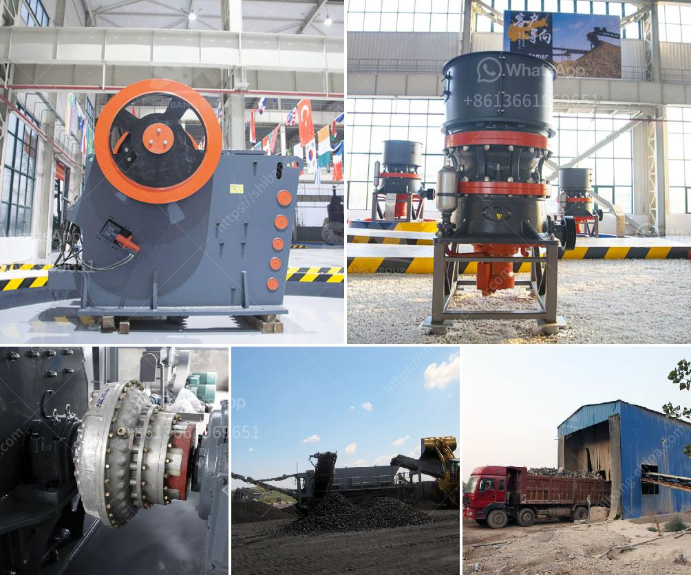

<h3>safety of conveyor belt ppt</h3>
The safety of conveyor belt systems is crucial in various industries, including manufacturing, mining, and logistics. Conveyor belts are used to transport heavy materials from one point to another, improving efficiency and productivity. However, due to their moving parts, there are inherent risks associated with their operation. It is essential to prioritize safety measures to minimize accidents and protect workers.

One way to ensure safety is through the use of comprehensive training programs. Employers should provide thorough training sessions for workers who will be operating or working near conveyor belts. These programs should cover the basics of conveyor belt operation, potential hazards, and safe practices. Workers should be trained on how to properly use the equipment, maintain it, and respond to emergencies. Regular refresher courses are also necessary to keep workers up to date with the latest safety protocols.

Another crucial aspect of conveyor belt safety is proper maintenance. Regular inspections and maintenance checks should be performed to detect any potential issues. Damaged or worn-out parts should be replaced promptly. Employers should also establish a preventive maintenance schedule to minimize the risk of unexpected breakdowns or failures. This can help to prevent accidents caused by faulty equipment and ensure the smooth and safe functioning of the conveyor belt system.

Guarding is an essential safety feature for conveyor belts. Employers should ensure that all conveyor belts have appropriate guarding in place to prevent workers from accidentally touching the moving parts. Guards should be well-maintained and securely fixed to the equipment. Adequate signage should also be used to warn workers of the dangers associated with the conveyor belt system.

Emergency stop systems are another critical safety measure. Conveyor belts should be equipped with emergency stops that allow workers to halt the system quickly in case of an emergency. The emergency stops should be easily accessible and clearly marked. Workers should be trained on how to use them effectively and when to activate them to prevent accidents or injuries.

Routine risk assessments should be conducted to identify potential hazards and implement suitable control measures. These assessments should involve evaluating the layout and design of the conveyor belt system, identifying any potential pinch points or entrapment areas, and assessing potential risks associated with the materials being transported. By identifying and addressing potential risks proactively, employers can minimize accidents and create a safer working environment.

Regular communication and open dialogue between workers and management are crucial for maintaining conveyor belt safety. Workers should feel comfortable reporting any safety concerns or near misses they witness or experience. Management should respond promptly to address these concerns and take appropriate action to ensure the safety of their employees.

In conclusion, ensuring the safety of conveyor belt systems is vital for the well-being of workers and the efficient operation of various industries. Implementing comprehensive training programs, conducting regular inspections and maintenance, using appropriate guarding, having emergency stop systems in place, conducting risk assessments, and fostering open communication are all essential measures for maintaining a safe working environment. Prioritizing safety not only protects workers from accidents and injuries but also enhances overall productivity and improves the reputation of the company.
<h3>Contact us</h3><ul><li><strong>Whatsapp:&nbsp;<a href="https://wa.me/8613661969651">+8613661969651</a></strong></li><li><a href="https://swt.shibang-china.com/?git&amp;zhl&amp;safety of conveyor belt ppt"><strong>Online Service(chat now)</strong></a></li></ul><h3>Related</h3><ul><li><a href='crushers and screeners for hire in usa.md'>crushers and screeners for hire in usa</a></li><li><a href='brazil best crusher manufacturing companies.md'>brazil best crusher manufacturing companies</a></li><li><a href='vibrating screens kenya.md'>vibrating screens kenya</a></li><li><a href='dolomite rock processing plan in ethiopia.md'>dolomite rock processing plan in ethiopia</a></li><li><a href='ball mill capacity 100 tph in gujarat.md'>ball mill capacity 100 tph in gujarat</a></li></ul>