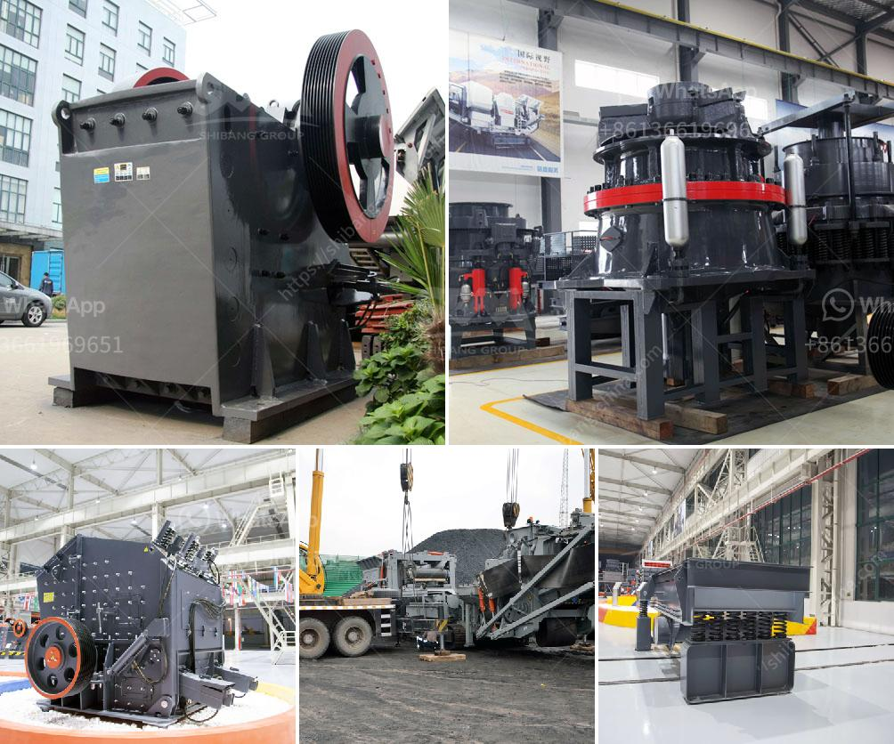

<h3>safety operation of crusher</h3>
Crushing is an important process in mining and other industries that involves reducing the size of materials for further processing. A crusher is a vital piece of machinery that is used for crushing materials. Unfortunately, it can often be a dangerous machine to operate. Therefore, it is of utmost importance to always follow proper safety measures when operating a crusher to prevent accidents and ensure the well-being of operators and workers.

First and foremost, before starting any operation, it is crucial to read and understand the manufacturer's instruction manual. This manual provides valuable information on the correct operation and maintenance of the crusher, as well as safety guidelines. It includes details on the machine's specific safety features and precautions to be taken while operating it. Familiarize yourself with the manual and always refer to it when in doubt.

One of the most fundamental safety measures is to ensure that the crusher is properly installed and maintained. Regular inspections and maintenance checks are essential to keep the machine in good working order. This includes ensuring that all parts are properly lubricated, replacing worn-out components, and checking for any loose or damaged parts that could compromise safety.

Personal protective equipment (PPE) is another critical element in ensuring crusher safety. It is essential for all operators and workers to wear the appropriate PPE, such as helmets, safety glasses, ear protection, and protective clothing. These items provide an extra layer of protection and help minimize the risk of injury from flying debris, dust, or noise-related damage.

The surrounding work area should be kept clean and free from any potential hazards. Before starting the crusher, make sure that there are no obstructions or loose objects that could impede its operation or pose a risk to operators. Additionally, ensure that there is proper lighting in the work area to enhance visibility and prevent accidents.

It is crucial to educate and train all operators on the safe operation of the crusher. Proper training will equip them with the necessary knowledge and skills to use the machine correctly and handle any potential emergency situation effectively. Regular refresher courses should be conducted to reinforce these safety practices.

When operating a crusher, it is vital to be cautious of any unusual sounds, vibrations, or odors emanating from the machine. These could be signs of mechanical problems or potential danger. If any abnormalities are detected, immediately shut down the crusher and conduct a thorough inspection before resuming operation.

Lastly, communication is key when operating a crusher. It is essential to establish clear and effective communication channels between operators and other workers in the vicinity. This ensures that everyone is aware of the crusher's operation and any potential hazards. Regular safety meetings should be conducted to discuss any concerns or issues that may arise during the operation.

In conclusion, the safe operation of a crusher is of utmost importance. Following proper safety measures not only protects operators and workers but also reduces the risk of accidents and potential damage to the machine. By reading and understanding the manufacturer's manual, regularly inspecting and maintaining the crusher, wearing the appropriate PPE, keeping the work area clean and hazard-free, properly training operators, monitoring the machine for any abnormalities, and establishing effective communication channels, operators can ensure the safe and efficient operation of the crusher.
<h3>Contact us</h3><ul><li><strong>Whatsapp:&nbsp;<a href="https://wa.me/8613661969651">+8613661969651</a></strong></li><li><a href="https://swt.shibang-china.com/?git&amp;zhl&amp;safety operation of crusher"><strong>Online Service(chat now)</strong></a></li></ul><h3>Related</h3><ul><li><a href='big stone crusher prices in south africa.md'>big stone crusher prices in south africa</a></li><li><a href='stone crushing plant cost.md'>stone crushing plant cost</a></li><li><a href='crusher plant dengan kapasitas 100 ton h.md'>crusher plant dengan kapasitas 100 ton h</a></li><li><a href='ball mill manufacturers in india for lime limestone.md'>ball mill manufacturers in india for lime limestone</a></li><li><a href='diatomite grinding mill in indonesia.md'>diatomite grinding mill in indonesia</a></li></ul>