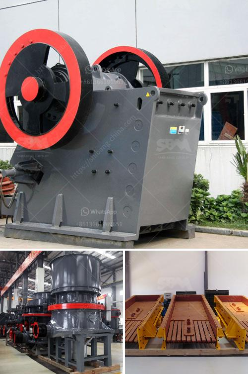

<h3>sale 42 jaw crusher in india</h3>
The jaw crusher, also known as the "crusher", is a heavy-duty machinery that is commonly used for breaking down materials into smaller pieces. This equipment is commonly used in various industries, including mining, metallurgy, construction, highways, railways, and chemical industries. In India, the sale of the 42 jaw crusher has been on the rise, and with good reason.

The demand for jaw crushers is increasing steadily, as more construction projects are being carried out in India, and the market for this equipment is expected to grow even further. The jaw crusher is often utilized for coarse crushing, which is not easily achieved by other types of crushers. The sturdy construction, high efficiency, and versatility of the jaw crusher make it an excellent choice for a wide range of applications.

One of the key factors contributing to the popularity of the 42 jaw crusher in India is its ample capacity. With a maximum feed size of 930mm and a processing capacity of up to 500tph, this robust machine can easily handle even the most demanding crushing tasks. Whether it is rock, gravel, or ore, the jaw crusher can efficiently break down the material into smaller, more manageable sizes.

Another advantage of the 42 jaw crusher is its advanced features and user-friendly design. With a simple and easy-to-use control panel, operators can quickly adjust the settings and customize the machine according to their specific requirements. This ensures optimal performance and maximum productivity.

The 42 jaw crusher is also known for its durability and reliability. Built to withstand tough working conditions, this machine is designed to withstand heavy loads and frequent use without compromising its performance. This ensures a longer lifespan and reduces maintenance costs in the long run.

Furthermore, the 42 jaw crusher is equipped with advanced safety features to protect both the operator and the machine itself. Safety guards and protective devices are in place to prevent accidents and minimize risks. This makes the jaw crusher a safe and reliable choice for any crushing operation.

In conclusion, the sale of the 42 jaw crusher in India is experiencing a steady rise due to the increasing demand for construction materials and the growth of the construction industry. The jaw crusher offers high efficiency and durability, making it an excellent choice for a variety of applications. With its advanced features, user-friendly design, and strong build quality, the 42 jaw crusher is a reliable and efficient machine that will help you get the job done.
<h3>Contact us</h3><ul><li><strong>Whatsapp:&nbsp;<a href="https://wa.me/8613661969651">+8613661969651</a></strong></li><li><a href="https://swt.shibang-china.com/?git&amp;zhl&amp;sale 42 jaw crusher in india"><strong>Online Service(chat now)</strong></a></li></ul><h3>Related</h3><ul><li><a href='advance stone agregate crusher equipments.md'>advance stone agregate crusher equipments</a></li><li><a href='designs of hammer mills.md'>designs of hammer mills</a></li><li><a href='calculation crusher plant cost.md'>calculation crusher plant cost</a></li><li><a href='india second hand ball mill for sale.md'>india second hand ball mill for sale</a></li><li><a href='distributors of conveyor belts in malaysia.md'>distributors of conveyor belts in malaysia</a></li></ul>