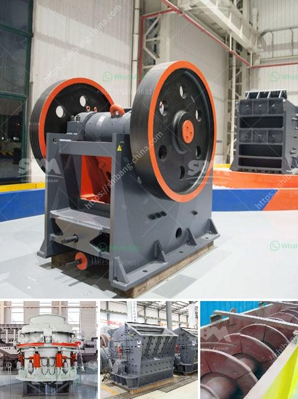

<h3>sale of stone crushers</h3>
Stone crushers, also called rock crushing machines, are crucial equipment in construction and mining industries. They are used to break large rocks into smaller pieces, making them easier to transport or further process. With the increasing demands for stone materials in construction projects, the sale of stone crushers has been popularized as well.

According to statistics, last year over 600 billion yuan was invested in infrastructure projects in China, and the demand for construction materials soared. This includes the demand for stone aggregates used in the production of concrete, asphalt, and road base materials. As a result, stone crushers are in high demand and companies that deal in such machinery are experiencing a surge in sales.

One of the factors driving the increased sales of stone crushers is the growth of the real estate industry. With the rapid urbanization and industrialization happening globally, the need for affordable housing and commercial spaces is constantly rising. Stone crushers are essential in the production line of stone materials after being processed by crushers, concrete can be used for construction purposes, and the remaining materials can be used in other construction projects or as aggregate for the base of roads.

Another factor contributing to the sales of stone crushers is the high cost of civil construction projects. Landscaping and demolition projects, for example, require the breaking down of large rocks and structures. Stone crushers come in handy in such situations by helping reduce the size of the waste material for easy disposal and recycling.

Furthermore, the popularity of stone crushers can be attributed to the developments in the field of technology and digitalization. With the advent of advanced technology, the operation and maintenance of stone crushers have become easier. These machines are now equipped with intelligent systems that can monitor their performance and send alerts in case of any issues. Additionally, the integration of automation and control systems has streamlined the entire process, making it more efficient and reducing human error.

Moreover, stone crushers are highly versatile machines that can be used in various applications. They can crush different types of stones and materials, including hard rocks, ore, building waste, and even glass. This versatility increases their usefulness and contributes to their increased sales.

In conclusion, the sale of stone crushers has been on the rise and China's infrastructure construction has been particularly strong in recent years. The growing demand for stone materials for infrastructure projects further stimulates the development of stone crushers. The sales market of cone crushers is gradually developing, and in recent years, the crushing equipment has been favored by investors. With the continuous improvement of crushers' technical level and their improved performance, crusher plants are better equipped to meet the increasing demands for stone materials in construction projects.
<h3>Contact us</h3><ul><li><strong>Whatsapp:&nbsp;<a href="https://wa.me/8613661969651">+8613661969651</a></strong></li><li><a href="https://swt.shibang-china.com/?git&amp;zhl&amp;sale of stone crushers"><strong>Online Service(chat now)</strong></a></li></ul><h3>Related</h3><ul><li><a href='types of crusher for ore processing.md'>types of crusher for ore processing</a></li><li><a href='mining rock quarry crusher for sale.md'>mining rock quarry crusher for sale</a></li><li><a href='small profile format for crusher company.md'>small profile format for crusher company</a></li><li><a href='how to setting up of stone crusher unit.md'>how to setting up of stone crusher unit</a></li><li><a href='large capacity ton per hour limestone crushers.md'>large capacity ton per hour limestone crushers</a></li></ul>