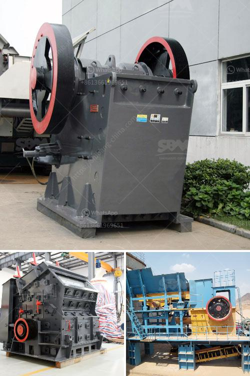

<h3>salvage value of crusher machine</h3>
The salvage value of a crusher machine is a common question asked by companies when it comes to purchasing or disposing of equipment. It’s essential to understand what salvage value is and how it affects your decision-making process.

Salvage value refers to the estimated worth of a piece of machinery at the end of its useful life, or when it is no longer operational or cost-effective to repair. In the case of a crusher machine, it represents the approximate amount you could expect to receive if you were to sell it as scrap metal or for parts.

Determining the salvage value of a crusher machine involves several factors. Firstly, you need to consider its age. Older machines generally have a lower salvage value as they may be outdated or require extensive repairs. On the other hand, newer machines tend to have higher salvage values as they are more likely to be functional and have modern features.

The condition of the machine also plays a crucial role in determining its salvage value. A machine that has been well-maintained and has minimal wear and tear will have a higher salvage value compared to a machine that has been poorly maintained or has significant damage.

Furthermore, the brand and model of the crusher machine can also impact its salvage value. Popular brands and models are more likely to have higher salvage values due to their reputation and demand in the market. Additionally, machines that have spare parts readily available are also more valuable as they can be easily repaired or used for spare parts.

To get an accurate estimation of the salvage value of a crusher machine, it is recommended to consult with professionals who specialize in equipment valuation or machinery appraisals. These experts can assess the machine based on its specific features, condition, and market value. They can provide you with an estimation that takes into account relevant market trends and industry benchmarks.

Understanding the salvage value of a crusher machine is crucial for various reasons. Firstly, it allows you to make informed decisions when it comes to purchasing new equipment. By considering the salvage value, you can evaluate the long-term cost-effectiveness of the machine, taking into account its expected lifespan and potential resale value.

Additionally, knowing the salvage value of a crusher machine is essential when disposing of old equipment. If the machine is no longer functional or is no longer required, knowing the estimated salvage value can help you determine the best course of action. You can decide whether to sell the machine for scrap, sell it as a whole unit, or dismantle it for parts.

In conclusion, the salvage value of a crusher machine is the estimated worth of the equipment at the end of its useful life. It is influenced by various factors such as age, condition, brand, and model. Understanding the salvage value can help companies make informed decisions when purchasing or disposing of equipment, ensuring that they maximize their investment and minimize unnecessary costs.
<h3>Contact us</h3><ul><li><strong>Whatsapp:&nbsp;<a href="https://wa.me/8613661969651">+8613661969651</a></strong></li><li><a href="https://swt.shibang-china.com/?git&amp;zhl&amp;salvage value of crusher machine"><strong>Online Service(chat now)</strong></a></li></ul><h3>Related</h3><ul><li><a href='construction equipment made in taiwan.md'>construction equipment made in taiwan</a></li><li><a href='gypsum calcination processing plant equipments.md'>gypsum calcination processing plant equipments</a></li><li><a href='dolomite mining crusher process.md'>dolomite mining crusher process</a></li><li><a href='rent a conveyor belts singapur.md'>rent a conveyor belts singapur</a></li><li><a href='crusher plant in rows.md'>crusher plant in rows</a></li></ul>