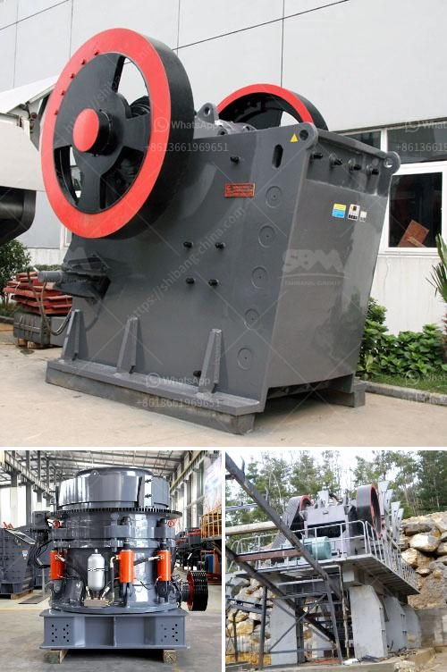

<h3>sand crushing grinding screening production machinerys</h3>
Sand is an essential material in construction and other industries, and its production process involves several stages, including crushing, grinding, and screening. In order to produce high-quality sand, various machinerys are required to achieve efficient and effective production.

The first step in the sand production process is crushing. Large rocks and stones are blasted and transported to the crushing equipment. Jaw crushers, impact crushers, or cone crushers are commonly used for this purpose. These machines break the rocks into smaller sizes, allowing for easier transportation and further processing.

After crushing, the next stage is grinding. This process refines the sand particles, ensuring that they are of the desired size and shape. Grinding machinerys such as ball mills, rod mills, or vertical mills are commonly used in this stage. These machines reduce the sand particles to a fine consistency, making them suitable for various applications.

Once the sand has been crushed and ground, it goes through the screening process. Screening machinerys are used to separate the sand particles based on their size. This ensures that the final product has consistent particle sizes and meets the desired specifications. Vibrating screens or trommel screens are commonly used in this stage. These machines have different screen sizes, allowing for the separation of different-sized sand particles.

In addition to the crushing, grinding, and screening machinerys, there are also other equipment involved in the sand production process. Conveyors are used to transport the crushed and ground sand from one stage to another. They ensure a smooth and continuous flow of material throughout the production line.

Dust collectors are also an important part of sand production machinerys. They help to control and minimize the dust generated during the crushing, grinding, and screening processes. This not only ensures the safety and health of workers but also prevents environmental pollution.

Furthermore, water is an essential component in the sand production process. It is used for washing and classifying the sand particles, removing impurities, and ensuring that the final product is clean and of high quality. Water recycling systems are often used to minimize water consumption and promote sustainability in the sand production industry.

In conclusion, the production of sand requires several machinerys to go through different stages, including crushing, grinding, and screening. These processes help to produce high-quality sand that is suitable for various applications in construction and other industries. The machinerys used in each stage, such as crushers, mills, screens, conveyors, dust collectors, and water recycling systems, play a crucial role in ensuring efficient and effective sand production. By utilizing these machinerys, the sand production industry can meet the growing demand for sand while maintaining environmental sustainability.
<h3>Contact us</h3><ul><li><strong>Whatsapp:&nbsp;<a href="https://wa.me/8613661969651">+8613661969651</a></strong></li><li><a href="https://swt.shibang-china.com/?git&amp;zhl&amp;sand crushing grinding screening production machinerys"><strong>Online Service(chat now)</strong></a></li></ul><h3>Related</h3><ul><li><a href='conveyor belt supplier in riyadh.md'>conveyor belt supplier in riyadh</a></li><li><a href='coal mining machine undercuter.md'>coal mining machine undercuter</a></li><li><a href='hammer mill impactor marble machina.md'>hammer mill impactor marble machina</a></li><li><a href='dry mix mortar plant from turkey.md'>dry mix mortar plant from turkey</a></li><li><a href='jaw crusher manufacturer in italy.md'>jaw crusher manufacturer in italy</a></li></ul>