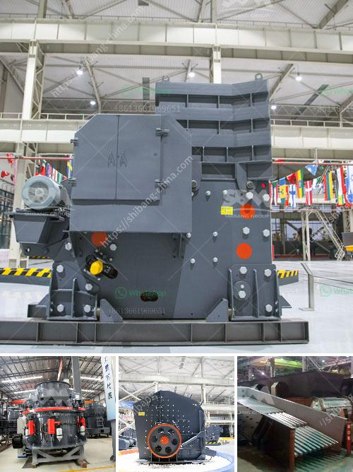

<h3>sand grinder zenith</h3>
The Zenith sand grinder is a high-performance machine that offers smooth and efficient grinding of various materials. With a comprehensive range of models, this grinder can cater to different grinding requirements, from coarse grinding to fine grinding.

One of the key features of the Zenith sand grinder is its superior grinding technology. Equipped with advanced grinding discs and a powerful motor, it delivers exceptional performance and ensures consistent and precise grinding results. The grinder is also designed with a large capacity hopper, allowing for continuous grinding without the need for frequent refilling.

The Zenith sand grinder is versatile and can handle a wide range of materials, including sand, minerals, ores, construction waste, and more. It is particularly suited for grinding sand, as it efficiently breaks down the particles, resulting in a more uniform and fine sand texture. This makes it an ideal choice for industries such as construction, mining, and chemical engineering.

The grinder is also designed with user convenience in mind. It features a user-friendly control panel, allowing for easy operation and adjustment of grinding parameters. The grinder is also equipped with safety features such as overload protection and a locking mechanism, ensuring safe and reliable operation.

In addition to its excellent performance and user-friendly design, the Zenith sand grinder is also built to last. Made with high-quality materials and robust construction, it is designed to withstand heavy-duty use in demanding industrial environments. The grinder also requires minimal maintenance, further reducing downtime and increasing productivity.

In conclusion, the Zenith sand grinder is a reliable and efficient machine that offers superior grinding performance. With its advanced technology, versatility, user-friendly design, and durability, it is an excellent choice for various grinding applications. Whether you need to grind sand, minerals, or other materials, the Zenith sand grinder will deliver exceptional results.
<h3>Contact us</h3><ul><li><strong>Whatsapp:&nbsp;<a href="https://wa.me/8613661969651">+8613661969651</a></strong></li><li><a href="https://swt.shibang-china.com/?git&amp;zhl&amp;sand grinder zenith"><strong>Online Service(chat now)</strong></a></li></ul><h3>Related</h3><ul><li><a href='balance calculations in vertical roller mill.md'>balance calculations in vertical roller mill</a></li><li><a href='suoer fine mill grinder.md'>suoer fine mill grinder</a></li><li><a href='hammer mills for bricks and blocks.md'>hammer mills for bricks and blocks</a></li><li><a href='gypsum grinding machine plant.md'>gypsum grinding machine plant</a></li><li><a href='vibrating screen price philippines.md'>vibrating screen price philippines</a></li></ul>