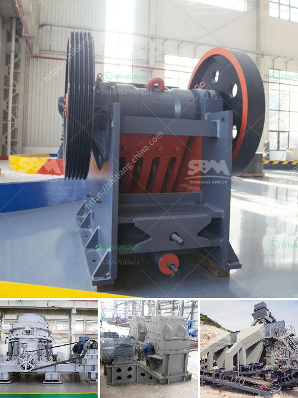

<h3>sand making crusher</h3>
Sand making crusher is a machine used to crush stones into sand. It is also known as sand making machine, construction sand making equipment, and construction waste disposal equipment, which is widely used in sand and gravel operations in various construction projects. It can be used to produce artificial sand, which is in line with the requirements of different construction standards and can improve the construction quality.

With the rapid development of infrastructure construction, the demand for sand and gravel has been increasing. Natural sand and gravel are not only lacking in supply but also cause environmental pollution. Therefore, the production of artificial sand has become a trend and priority in the field of construction.

Sand making crusher, as an important equipment in sand production line, has been continuously improved and developed over the years. It has a remarkable advantage in terms of performance, efficiency, and energy-saving. The sand making crusher is mainly composed of feeding hopper, distributor, crushing chamber, impeller assembly, base, transmission device, and motor.

The operation principle of the sand making crusher is as follows: the material enters the crushing chamber through the feeding hopper, and is divided into two parts by the distributor. One part enters the high-speed rotating impeller through the middle of the distributor, and is rapidly accelerated in the impeller. The acceleration can achieve up to hundreds of times the acceleration of gravity. Then, the material is thrown out through the impeller's high-speed impact to form a curtain of material, and some of it falls from the periphery of the impeller. These materials collide, rub, and crush each other to form a vortex motion between the impeller and the casing. The crushed materials then go through multiple impact, friction, and grinding to achieve the desired particle size and shape. The finished sand is discharged from the discharge opening to complete the whole process.

The sand making crusher has many advantages. Firstly, it has a high crushing ratio, which can produce high-quality and uniform-shaped aggregates. Secondly, it has a low energy consumption and can save energy by 50% compared to traditional crushing equipment. Thirdly, the wear-resistant parts have a long service life, reducing maintenance costs. Lastly, it has a simple structure and easy operation, making it suitable for various construction projects.

In conclusion, the sand making crusher plays an indispensable role in the production of artificial sand. With its high crushing ratio, low energy consumption, and long service life of wear-resistant parts, it can effectively produce high-quality sand and gravel aggregates. As the demand for sand and gravel continues to increase, the sand making crusher will have a broad market prospect for its excellent performance and environmental protection characteristics.
<h3>Contact us</h3><ul><li><strong>Whatsapp:&nbsp;<a href="https://wa.me/8613661969651">+8613661969651</a></strong></li><li><a href="https://swt.shibang-china.com/?git&amp;zhl&amp;sand making crusher"><strong>Online Service(chat now)</strong></a></li></ul><h3>Related</h3><ul><li><a href='components of a roller mill.md'>components of a roller mill</a></li><li><a href='how much is a hammer mill.md'>how much is a hammer mill</a></li><li><a href='tanzania processing plant cost.md'>tanzania processing plant cost</a></li><li><a href='hammer mill components.md'>hammer mill components</a></li><li><a href='south africa suppliers of chrome ore beneficiation plant.md'>south africa suppliers of chrome ore beneficiation plant</a></li></ul>