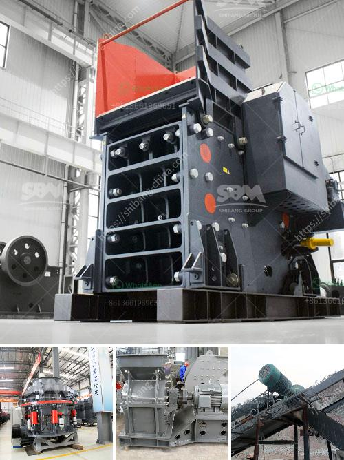

<h3>sand making machine roller mill</h3>
The sand making machine has become the key equipment in sand production lines, construction, and development of infrastructure. With the increase in demand for sand, natural resources are being depleted, and the environment is being severely damaged. Traditional sand production methods are inefficient and cannot meet the requirements of modern sand production.

To address these challenges, a revolutionary sand making machine known as the roller mill has been developed. The roller mill is a crushing and grinding equipment that utilizes a rotating cylindrical roller to crush and grind material. It offers several advantages over traditional sand making machines, making it a preferred choice for many industries.

Firstly, the roller mill effectively processes hard and abrasive materials, ensuring a high-quality end product. The high-pressure grinding rollers crush the material by applying a high pressure between the rollers and the material particles. This mechanism ensures that even the toughest materials can be broken down into fine particles, meeting the requirements of various industries.

Secondly, the roller mill has excellent energy efficiency. Compared to traditional sand making machines, the roller mill consumes less energy while delivering superior performance. This is due to the unique design of the roller mill, which reduces friction and heat generation during the crushing and grinding process. As a result, the roller mill offers significant cost savings in terms of electricity consumption and maintenance costs.

Furthermore, the roller mill is highly versatile and can be used for various types of materials. Whether it is limestone, granite, basalt, or any other material, the roller mill can effectively handle it. This versatility makes it a valuable asset for different industries, including mining, construction, and chemical production. With the roller mill, companies can streamline their operations by having a single machine to handle different materials and reduce the need for multiple machines.

The roller mill also offers a higher degree of control over the final product. By adjusting the roller gaps and speed, operators can fine-tune the particle size and shape of the crushed material. This provides flexibility for different applications, such as producing sand of varying specifications for different construction projects. With precise control, companies can ensure that the sand meets the required standards, enhancing their reputation and customer satisfaction.

In addition to these benefits, the roller mill has a compact design, occupying less space compared to traditional sand making machines. This is a crucial advantage, especially in industries with limited space availability. The smaller footprint of the roller mill allows companies to maximize the utilization of their workspace and potentially increase production capacity.

In conclusion, the roller mill is a revolutionary sand making machine that offers numerous advantages over traditional methods. Its ability to process hard and abrasive materials, excellent energy efficiency, versatility, and controllability make it a preferred choice for various industries. With the roller mill, companies can optimize their sand production processes, reduce costs, and minimize their environmental impact. As the demand for sand continues to rise, the roller mill stands as a game-changer in the field of sand production.
<h3>Contact us</h3><ul><li><strong>Whatsapp:&nbsp;<a href="https://wa.me/8613661969651">+8613661969651</a></strong></li><li><a href="https://swt.shibang-china.com/?git&amp;zhl&amp;sand making machine roller mill"><strong>Online Service(chat now)</strong></a></li></ul><h3>Related</h3><ul><li><a href='industrial gold mining equipment suppliers.md'>industrial gold mining equipment suppliers</a></li><li><a href='runner crusher china price.md'>runner crusher china price</a></li><li><a href='supplier for crusher.md'>supplier for crusher</a></li><li><a href='ball mill diagram manufacturers in bangalore.md'>ball mill diagram manufacturers in bangalore</a></li><li><a href='size and capasity typical jaw crusher.md'>size and capasity typical jaw crusher</a></li></ul>