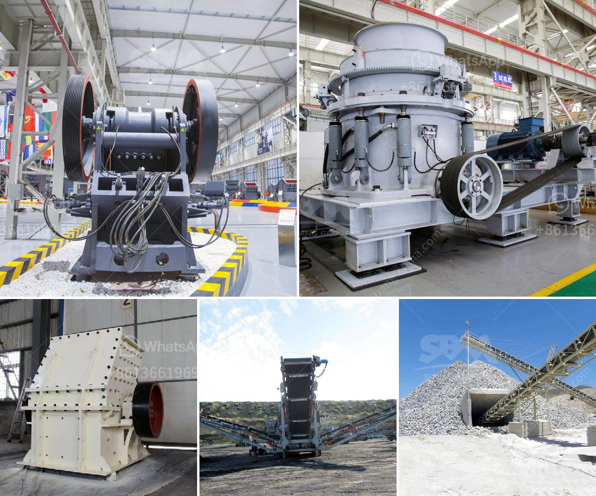

<h3>sand making machine saudi</h3>
The construction industry in Saudi Arabia is witnessing substantial growth due to various infrastructure development projects. One crucial element in constructing buildings, roads, bridges, and other structures is the use of sand. Sand plays a vital role in the construction process, but the availability of high-quality sand is limited in certain regions. To tackle this issue, the sand making machine has emerged as a remarkable solution in the Saudi Arabian market.

The sand making machine, also known as the vertical shaft impact crusher (VSI), has gained popularity as Saudi Arabia rapidly progresses in tackling construction-related challenges. The sand making machine uses rocks and stones as raw materials to produce artificial sand, which is highly sought after in the construction industry. The machine's innovative technology results in savings on both time and energy, while producing quality products to meet the highest standards.

One of the prominent features of the sand making machine is its ability to shape the sand particles as per the required specifications. With its adjustable rotor speed and multiple crushing chambers, the machine can produce sand with various gradations and sizes. This flexibility opens up a wide range of possibilities for use in different construction applications, such as concrete production, asphalt mix, and road base.

Another advantage of the sand making machine is its efficiency in preserving natural resources and minimizing environmental impact. By utilizing rocks and stones, the machine reduces the need for excessive sand extraction from river beds and coastal areas. This helps in preserving the delicate ecosystems and preventing further degradation of the environment. Additionally, the use of artificial sand produced by the machine reduces the dependence on natural sand, which is becoming scarce in certain regions of Saudi Arabia.

Furthermore, the sand making machine offers enhanced productivity and cost-effectiveness to construction companies. Its automated operation and minimal human intervention enable consistent and uniform sand production. The machine's high crushing efficiency results in increased output capacity, allowing construction companies to meet project deadlines and demands effectively. Moreover, the sand making machine requires relatively low maintenance and operating costs, making it an economically viable option for construction firms.

In terms of safety, the sand making machine also stands out due to its advanced design and protective measures. The machine is equipped with safety guards and multiple safety features to prevent accidents and ensure a secure working environment. Construction companies in Saudi Arabia can rely on the sand making machine to provide a safe and efficient solution for their sand production needs.

As Saudi Arabia continues to undergo massive development and construction projects, the sand making machine proves to be a valuable asset in meeting the growing demand for high-quality sand. Its ability to produce artificial sand with desired specifications, its environmental friendliness, and its cost-effectiveness make it an ideal choice for construction companies. The sand making machine not only enhances the construction industry's capabilities but also contributes to the sustainable growth of Saudi Arabia as a whole.
<h3>Contact us</h3><ul><li><strong>Whatsapp:&nbsp;<a href="https://wa.me/8613661969651">+8613661969651</a></strong></li><li><a href="https://swt.shibang-china.com/?git&amp;zhl&amp;sand making machine saudi"><strong>Online Service(chat now)</strong></a></li></ul><h3>Related</h3><ul><li><a href='crushing b series vsi crusher.md'>crushing b series vsi crusher</a></li><li><a href='rock grinder crusher suppliers kenya.md'>rock grinder crusher suppliers kenya</a></li><li><a href='power of a hammer mill.md'>power of a hammer mill</a></li><li><a href='tanzania processing plant cost.md'>tanzania processing plant cost</a></li><li><a href='gold refining plant italia setup.md'>gold refining plant italia setup</a></li></ul>