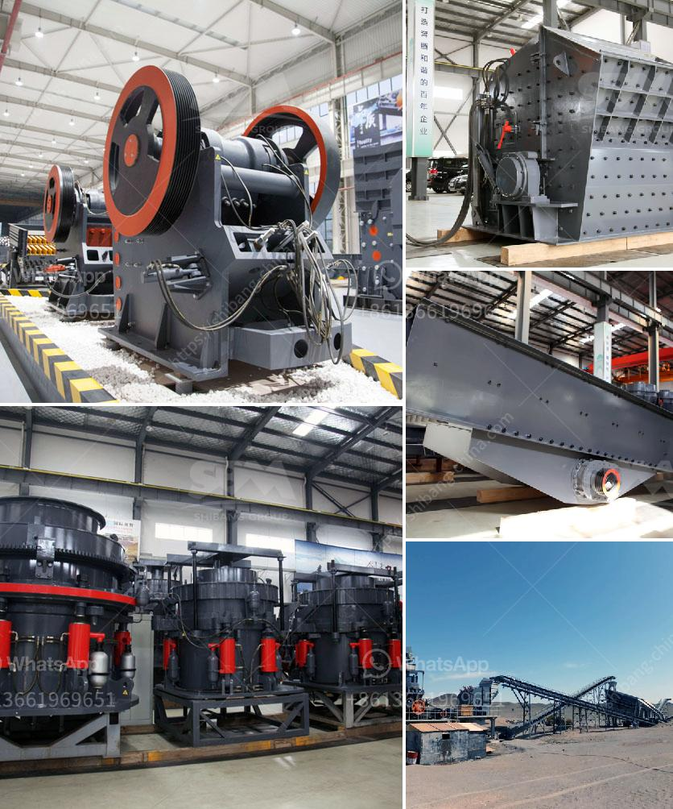

<h3>sand making plant</h3>
A sand making plant is a crucial part of any construction and mining industry. It is used to produce artificial sand from various minerals and rocks, such as limestone, granite, basalt, barite, and other hard materials. With the booming demand for sand in the construction industry, the sand making plant plays a vital role in meeting the market's requirements.

The process of sand making involves several stages. Firstly, the raw materials are crushed by a jaw crusher or cone crusher. Then, the crushed materials are sent to a vibrating screen to separate them into different particle sizes. The oversized materials are returned to the crusher for re-crushing, while the properly sized materials are sent to a sand making machine.

The sand making machine, also known as a vertical shaft impact crusher, is an efficient and energy-saving equipment. It has two working principles: stone-hit-stone and stone-hit-iron. The former uses the high-speed rotation of the impeller to crush the materials, while the latter uses the collision between materials and hammers to reshape them. This machine can produce high-quality and evenly graded artificial sand.

Once the materials are crushed and shaped by the sand making machine, they are sent to a vibrating screen for screening. The screened products are divided into different specifications according to their particle sizes, and the unqualified ones are returned to the sand making machine for re-processing. The qualified artificial sand is then stored in a sand storehouse and transported to construction sites by trucks or conveyor belts.

A sand making plant has several advantages. Firstly, it can produce high-quality and evenly graded artificial sand, which can be used as a substitute for natural sand in various construction projects. This helps to reduce the dependency on river sand and protect the environment. Secondly, the sand making plant has a high degree of automation and low operation and maintenance costs. It can operate continuously for a long time, ensuring a stable and efficient production process. Thirdly, the sand making plant has a small footprint and flexible configuration. It can be set up in different locations to meet the specific requirements of construction projects.

However, setting up a sand making plant requires careful planning and consideration. Factors such as raw materials, production capacity, finished product requirements, and budget should be taken into account. Additionally, the selection of equipment, such as crushers, sand making machines, and vibrating screens, should be done based on the specific needs of the project.

In conclusion, a sand making plant is an essential facility in the construction and mining industry. It plays a significant role in producing high-quality artificial sand, meeting the increasing demand for sand in construction projects. With its advantages of high efficiency, low cost, and environmental friendliness, the sand making plant is becoming increasingly popular among construction companies and mining enterprises.
<h3>Contact us</h3><ul><li><strong>Whatsapp:&nbsp;<a href="https://wa.me/8613661969651">+8613661969651</a></strong></li><li><a href="https://swt.shibang-china.com/?git&amp;zhl&amp;sand making plant"><strong>Online Service(chat now)</strong></a></li></ul><h3>Related</h3><ul><li><a href='concrete batching plant for sale in pakistan.md'>concrete batching plant for sale in pakistan</a></li><li><a href='nigeria inpactor crushers price.md'>nigeria inpactor crushers price</a></li><li><a href='jaw crusher with different size supplier in india.md'>jaw crusher with different size supplier in india</a></li><li><a href='clinker grinding mill machine germany.md'>clinker grinding mill machine germany</a></li><li><a href='prices of stone crushers from nigeria.md'>prices of stone crushers from nigeria</a></li></ul>