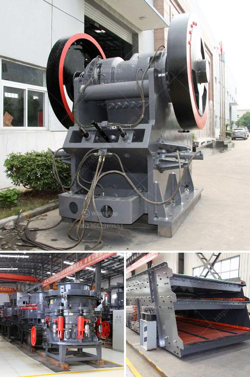

<h3>sand mining equipment malaysia</h3>
Sand mining is an increasingly lucrative business in Malaysia. According to a report by the United Nations Environmental Programme (UNEP), the global demand for sand is not only driven by construction and infrastructure development, but also by industries such as glass manufacturing and hydraulic fracking. With its abundant resources, Malaysia has become one of the top suppliers of sand to countries around the world.

Sand mining equipment plays a crucial role in facilitating the process of extracting this valuable resource. However, some of the machinery used can cause significant environmental damage, leading to a negative impact on both the ecosystem and local communities.

One of the most commonly used pieces of equipment in sand mining is the dredge. Dredges are large machines that dig and scoop up sand from the bottom of lakes, rivers, or oceans. They come in various sizes and can be either stationary or mobile. These powerful machines are capable of extracting large quantities of sand in a short period of time, making them highly efficient for industrial-scale operations.

However, the use of dredges has raised concerns due to its potential impact on the environment. Some of the negative consequences include habitat destruction, alteration of river flow, and erosion. Dredging can disrupt aquatic ecosystems, leading to the loss of biodiversity and the destruction of fish habitats. It can also increase the risk of flooding and loss of land due to altered river flow patterns.

Another commonly used equipment in sand mining is the sand washer. This machine is used to wash and separate sand particles from impurities such as clay, soil, and organic matter. The cleaned sand is then ready for use in construction projects or other industries. Sand washers are essential for ensuring the quality and purity of the sand.

However, improper use of sand washers can lead to significant environmental damage. The wastewater generated during the washing process is often discharged into nearby bodies of water, which can cause pollution and harm aquatic life. In order to minimize the negative impact, proper wastewater treatment and management are crucial.

In recent years, concerns over the environmental impact of sand mining have prompted the Malaysian government to regulate the industry more effectively. The Ministry of Natural Resources and Environment has implemented stricter guidelines and regulations to ensure sustainable sand mining practices. These include conducting environmental impact assessments, monitoring mining activities, and enforcing penalties for non-compliance.

There are also efforts to promote the use of more eco-friendly sand mining equipment. For instance, some companies have developed innovative technologies that can extract sand with minimal environmental damage. These technologies aim to reduce the disturbance of aquatic ecosystems, minimize the release of harmful chemicals, and improve the efficiency of sand extraction.

In conclusion, sand mining equipment plays a crucial role in meeting the global demand for sand. However, it is essential to ensure that the extraction process is carried out sustainably to minimize its adverse environmental impact. The Malaysian government's efforts to regulate the industry and promote eco-friendly equipment are steps in the right direction, but more needs to be done to strike a balance between economic growth and environmental protection. With the right practices and technologies, sand mining can contribute to Malaysia's economic development while preserving its natural heritage.
<h3>Contact us</h3><ul><li><strong>Whatsapp:&nbsp;<a href="https://wa.me/8613661969651">+8613661969651</a></strong></li><li><a href="https://swt.shibang-china.com/?git&amp;zhl&amp;sand mining equipment malaysia"><strong>Online Service(chat now)</strong></a></li></ul><h3>Related</h3><ul><li><a href='cost of limestone pulverizer.md'>cost of limestone pulverizer</a></li><li><a href='stone quarries cursher south africa.md'>stone quarries cursher south africa</a></li><li><a href='price of iron ore crusher machine.md'>price of iron ore crusher machine</a></li><li><a href='small gravel crushers.md'>small gravel crushers</a></li><li><a href='raymond mill price.md'>raymond mill price</a></li></ul>