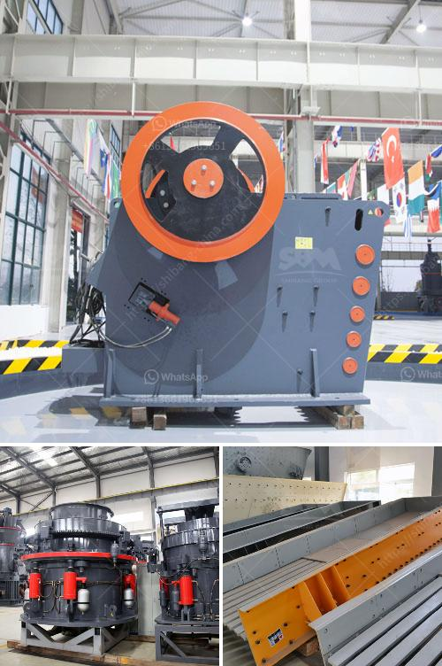

<h3>sand screeding machine prices</h3>
Sand screeding is an essential process in construction and flooring projects, which involves smoothing and leveling the surface using a sand screeding machine. These machines have become increasingly popular in recent years due to their efficiency and accuracy in achieving a perfectly level floor. However, before investing in a sand screeding machine, it is important to consider the various factors that influence their prices.

One of the primary factors that affect sand screeding machine prices is the type and size of the machine. Sand screeding machines come in different forms, such as walk-behind or ride-on models. Walk-behind machines are typically smaller and more affordable, making them suitable for smaller projects or tight spaces. On the other hand, ride-on machines are larger and more powerful, capable of covering larger areas in a shorter time. Naturally, the larger machines tend to be more expensive than their smaller counterparts.

Another factor to consider when determining the price of a sand screeding machine is the brand and reputation. There are numerous manufacturers and brands on the market, each with its own pricing strategy and quality. Well-established and reputable brands may command higher prices due to their reliability and durability. It is crucial to invest in a quality machine that will deliver consistent results and withstand the rigors of heavy-duty construction work.

The capacity and features of a sand screeding machine also influence its price. Machines with larger hoppers and higher output capacities are generally more expensive. These machines are capable of storing and dispensing larger quantities of sand, reducing the frequency of refilling and increasing productivity. Additional features such as automatic leveling or adjustable screeding depth may also increase the price. These features enhance precision and ease of use, which is highly beneficial for achieving the desired floor level.

The condition of the machine is another factor that can affect its price. New machines often come with a higher price tag due to their untouched and pristine condition, backed by warranties and after-sales support. However, there is a market for used or refurbished sand screeding machines that offer a more cost-effective solution. Buyers may find good deals on pre-owned machines, provided they are in good working condition and come from reputable sources.

Lastly, geographical location and market demand can also impact sand screeding machine prices. Prices may vary depending on the location and availability of machines in a particular region. Additionally, market demand can drive the prices up or down. In highly competitive areas with numerous suppliers and a high demand for sand screeding services, prices may be more competitive. Conversely, in areas with limited suppliers or high demand, prices may be higher.

In conclusion, sand screeding machine prices are influenced by several factors, including the type, size, brand, capacity, features, condition, and market demand. It is important for buyers to carefully consider their specific requirements and budget before making a purchase. By researching different options, comparing prices, and consulting with industry professionals, buyers can find the right sand screeding machine that meets their needs while staying within their budget.
<h3>Contact us</h3><ul><li><strong>Whatsapp:&nbsp;<a href="https://wa.me/8613661969651">+8613661969651</a></strong></li><li><a href="https://swt.shibang-china.com/?git&amp;zhl&amp;sand screeding machine prices"><strong>Online Service(chat now)</strong></a></li></ul><h3>Related</h3><ul><li><a href='250 mesh hammer mill.md'>250 mesh hammer mill</a></li><li><a href='ball mill price list philippines.md'>ball mill price list philippines</a></li><li><a href='price list stone crusher machine sri lanka.md'>price list stone crusher machine sri lanka</a></li><li><a href='mobile quarry crushing plant for sale in jamaica.md'>mobile quarry crushing plant for sale in jamaica</a></li><li><a href='france used conveyor belts for sale.md'>france used conveyor belts for sale</a></li></ul>