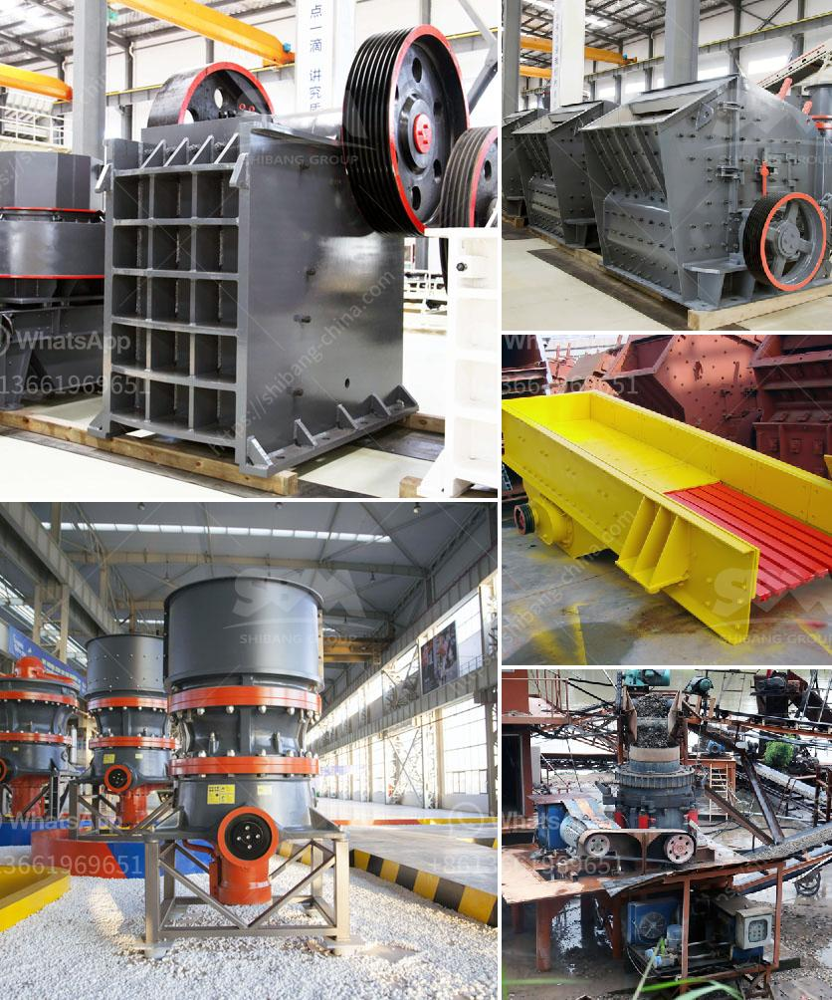

<h3>sand screen with vibrator</h3>
Sand screening is an essential process in various industries, from construction to mining. It involves the separation of small particles from larger ones, promoting a more uniform and efficient use of sand. One common approach to sand screening is using a sand screen with a vibrator, a device that enhances the overall screening process. In this article, we will discuss the benefits and applications of sand screens with vibration.

A sand screen with a vibrator essentially consists of a mesh screen panel and a vibrator motor. The mesh screen panel acts as the primary screening surface, allowing only particles of a certain size to pass through, while larger particles are retained. On the other hand, the vibrator motor generates intense vibrations that help to dislodge and separate the finer particles from the larger ones.

One of the main advantages of using a sand screen with a vibrator is its ability to improve screening efficiency. The vibrations generated by the vibrator motor help to create movement and agitation within the sand, effectively loosening any trapped particles or clumps. This enhances the overall screening process, ensuring that finer particles are efficiently separated from the larger ones. As a result, the sand screen with a vibrator can achieve higher screening capacities and increased production rates.

Another significant benefit of using a sand screen with vibration is its ability to prevent blinding. Blinding occurs when fine particles become trapped in the mesh screen, blocking the passage of any additional particles. This leads to a reduction in screening efficiency and can even halt the screening process entirely. By incorporating vibrations, the sand screen prevents blinding by constantly agitating the particles, preventing them from settling and clogging the mesh screen. This helps to ensure continuous and uninterrupted screening, improving both productivity and operational efficiency.

Sand screens with vibration find applications in a range of industries. In construction, these screens are commonly used for sand and gravel separation, ensuring that only the desired particle sizes are used in concrete production. Similarly, in the mining industry, sand screens with vibration are used for mineral separation, processing ores, and removing impurities. These screens are also widely employed in agriculture, particularly in the screening of sand for soil amendment purposes.

When selecting a sand screen with a vibrator, it is important to consider certain factors. These include the required screening capacity, the desired particle size range, the material properties of the sand, and operational conditions. It is crucial to choose a screen size and mesh opening that aligns with the specific requirements of the application to achieve optimal screening efficiency.

In conclusion, sand screening is a critical process in various industries, and sand screens with vibration offer several advantages. The combination of a mesh screen panel and a vibrator motor enhances screening efficiency, leading to increased production rates. By preventing blinding, the sand screen with a vibrator ensures uninterrupted screening and improved operational efficiency. Whether used in construction, mining, or agriculture, sand screens with vibration play a vital role in achieving effective particle separation and promoting a more uniform sand utilization.
<h3>Contact us</h3><ul><li><strong>Whatsapp:&nbsp;<a href="https://wa.me/8613661969651">+8613661969651</a></strong></li><li><a href="https://swt.shibang-china.com/?git&amp;zhl&amp;sand screen with vibrator"><strong>Online Service(chat now)</strong></a></li></ul><h3>Related</h3><ul><li><a href='impact crusher vsi price alibaba.md'>impact crusher vsi price alibaba</a></li><li><a href='jaw industry limestone process.md'>jaw industry limestone process</a></li><li><a href='sand screening machine south africa.md'>sand screening machine south africa</a></li><li><a href='barite mining and quarry equipment spain.md'>barite mining and quarry equipment spain</a></li><li><a href='granite grinder and crushers.md'>granite grinder and crushers</a></li></ul>