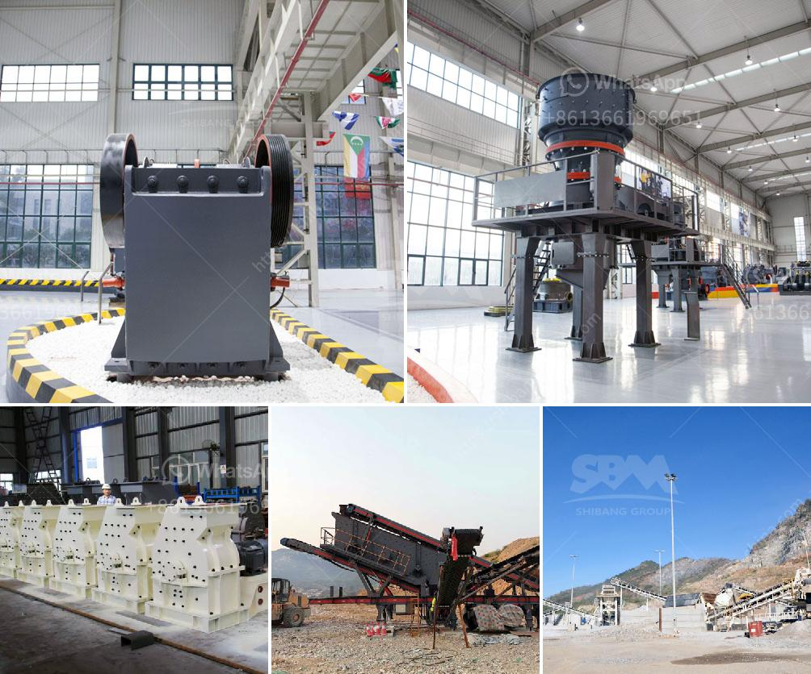

<h3>sand screening machine south africa</h3>
The sand screening machine is a unique machine designed to separate sands and aggregates that are mixed together during the sand mining process in South Africa. Due to the ever-increasing demand for sand in various industries, the need to separate it from unwanted materials such as clay, rocks, and other debris is essential. The sand screening machine plays a crucial role in accomplishing this task efficiently.

South Africa is home to a plethora of sand mines, from small riverbed sand mines to large sand mines located in densely populated urban areas. The sand mining process involves several steps, including crushing, screening, and storing. To ensure the quality of the sand, it is necessary to remove any unwanted debris and clay that might be mixed in during these processes. The sand screening machine is used to clean and separate the sand particles.

Unlike other machines, the sand screening machine is a unique and versatile piece of equipment that is able to screen and separate materials such as soil, gravel, rocks, and sand down to specific sizes. The resulting sand particles are known as sand grains, and they are used in various industrial applications, such as construction, landscaping, gardening, and drainage systems.

The sand screening machine South Africa is generally employed in the sand screening process, together with vibrating screen, which are one of the essential pieces of equipment in the sand screening process. In addition, the sand screen machine South Africa is equipped with a current relay to prevent the motor from being damaged in case of overload. A sand screen machine South Africa is a mechanical device used to separate materials by particle size, mainly used in the mineral and solid-waste sorting industries.

The sand screening machine South Africa is suitable for screening different materials. Sand and gravel are the main materials that are used in construction sites. The sand screening machine South Africa is a sand sieving machine that is widely used in mining, building materials, transportation, chemical industry, and so on. It is an ideal equipment for the separation of sand and minerals. All kinds of specifications of sieving operations can be carried out.

The purpose of the sand screening machine is to separate the gravel and foreign matter from the sand by the sieve plate, and then carry out water washing to remove impurities. The sand screening machine has a high degree of cleaning, which can effectively use the equipment to remove impurities in the sand, but at the same time, it can also reduce the loss of sand during the cleaning operation, which has saved the cost of cleaning operations.

In conclusion, the sand screening machine South Africa is an essential piece of equipment for the sand sieving process, and sand particles removal. It can help South Africa to enhance the quality of sand and protect the environment. Considering the strong demand of construction and mining industries in South Africa, the use of more efficient sand screening machines will be beneficial for both the sand mining industry and the construction industry.
<h3>Contact us</h3><ul><li><strong>Whatsapp:&nbsp;<a href="https://wa.me/8613661969651">+8613661969651</a></strong></li><li><a href="https://swt.shibang-china.com/?git&amp;zhl&amp;sand screening machine south africa"><strong>Online Service(chat now)</strong></a></li></ul><h3>Related</h3><ul><li><a href='china clay processing.md'>china clay processing</a></li><li><a href='argentina hammer mills manufacturers.md'>argentina hammer mills manufacturers</a></li><li><a href='company that work in crushing stones.md'>company that work in crushing stones</a></li><li><a href='gold refining and essay report equipment.md'>gold refining and essay report equipment</a></li><li><a href='machine de fabrication de sable de platre.md'>machine de fabrication de sable de platre</a></li></ul>