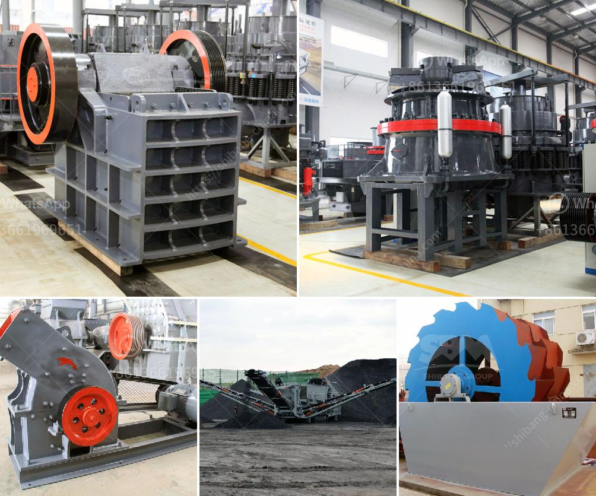

<h3>sand washer machine</h3>
In various industries like construction, mining, and quarrying, sand is widely used as an essential material. However, the natural sand available is often mixed with impurities like clay, silt, and rocks, which hampers its quality and usability. To address this issue, the sand washer machine has become a vital tool that efficiently cleans and separates impurities from the sand, ensuring high-quality output.

The sand washer machine, also known as a sand washing machine or simply sand washer, is a device used to remove impurities from sand through the process of washing. The machine combines the principles of centrifugal force, friction, and water flow to achieve the desired result. It works by immersing the sand in water, which agitates and dislodges the impurities. The water, along with the dislodged impurities, is then discharged through the machine's outlet, leaving behind clean and refined sand.

The sand washer machine is equipped with various components that contribute to its excellent cleaning performance. Firstly, a motor powers the machine, providing the necessary energy for the entire process. The motor ensures the proper functioning of the machine, allowing it to handle large volumes of sand effectively. Additionally, the machine's drum or tub, which accommodates the sand, is designed with an optimal shape and size to maximize the cleaning efficiency.

One of the essential features of the sand washer machine is its ability to retain and remove fine sand particles. Fine sand particles often cling to the surface of larger sand particles, making it challenging to separate them. However, the sand washer machine's design incorporates specialized paddles, gears, or flights that effectively agitate and separate the fine particles from the coarser ones, resulting in a clean sand product.

Furthermore, the sand washer machine is equipped with water sprays or nozzles strategically placed inside the drum. These sprays continuously inject water into the drum to ensure thorough cleaning. The water, combined with the mechanical action of the paddles or gears, dislodges the impurities from the sand particles, allowing for effective removal. Some advanced models even offer adjustable water pressure and flow rate controls, allowing operators to customize the washing process based on specific requirements.

The sand washer machine not only cleans the sand but also helps in reducing the environmental impact. By removing impurities from the sand, the machine ensures that the final product is suitable for use in various applications, such as concrete production, road construction, and manufacturing of building materials. Consequently, the use of clean sand obtained through efficient washing leads to improved durability of structures and optimized resource utilization.

In conclusion, the sand washer machine plays a crucial role in the construction, mining, and quarrying industries by efficiently cleaning and separating impurities from sand. With its motor-driven mechanism, special paddles or gears, and strategically placed water sprays, this machine ensures the production of high-quality, clean sand. Its ability to retain and remove fine sand particles further enhances its cleaning efficiency. Ultimately, the sand washer machine positively impacts various industries, facilitating the production of superior-quality materials while minimizing the environmental footprint.
<h3>Contact us</h3><ul><li><strong>Whatsapp:&nbsp;<a href="https://wa.me/8613661969651">+8613661969651</a></strong></li><li><a href="https://swt.shibang-china.com/?git&amp;zhl&amp;sand washer machine"><strong>Online Service(chat now)</strong></a></li></ul><h3>Related</h3><ul><li><a href='stone crushing plant cost.md'>stone crushing plant cost</a></li><li><a href='bauxite crushing machine in maharashtra.md'>bauxite crushing machine in maharashtra</a></li><li><a href='china pasir harga washing plant.md'>china pasir harga washing plant</a></li><li><a href='mobile asphalt plant for sale in dubai.md'>mobile asphalt plant for sale in dubai</a></li><li><a href='iron processing plant for sale.md'>iron processing plant for sale</a></li></ul>