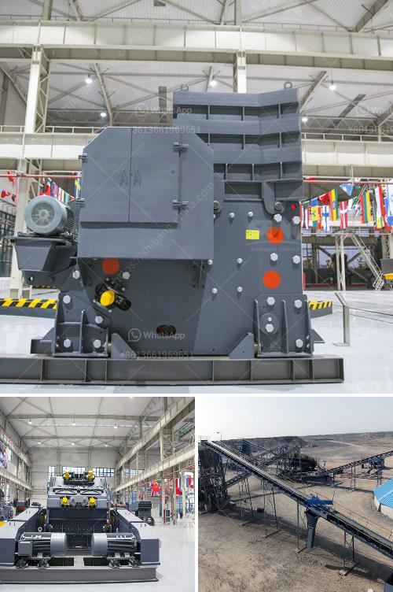

<h3>sand washer turkey</h3>
Sand washer is a vital equipment for sand washing in various construction sites, quarries, and mines. With the rapid development of infrastructure projects, the demand for sand and gravel is increasing, and the quality requirements for aggregates are becoming stricter. In Turkey, the sand washer industry has seen significant growth in recent years, with the country being one of the major players in the global mining and construction markets.

Turkey is rich in mineral resources, with abundant reserves of sand and gravel. However, the natural sand and gravel resources are not always ideal for use in construction, as they often contain impurities such as clay, silt, and organic materials. Sand washers are designed to remove these impurities and provide clean and high-quality sand and gravel for construction purposes.

Sand washers are available in various sizes and configurations, depending on the specific requirements of the site. The basic operation of a sand washer involves feeding the sand into a tank, where it is mixed with water and agitated to remove the impurities. The clean sand is then discharged from the bottom of the tank, while the impurities are carried away by the overflow of water.

In Turkey, the sand washer industry has witnessed significant advancements in technology and innovation. Turkish manufacturers are known for their high-quality and reliable sand washer equipment. They have been successful in developing machines that are efficient, durable, and easy to operate. These machines are designed to handle a wide range of materials, from fine sand to coarse aggregates, and are capable of producing different grades of sand based on the specific requirements of the customers.

One of the leading sand washer manufacturers in Turkey is Cimmaş Makina, which has been serving the industry for over 30 years. Cimmaş Makina offers a wide range of sand washer models, including bucket wheel washers, screw washers, and hydrocyclone washers.

Bucket wheel washers are suitable for washing and dewatering sand and gravel materials. These machines have a rotating wheel with buckets that scoop up the sand, wash it, and discharge it into a dewatering screen. The dewatered sand is then discharged onto a conveyor for further processing.

Screw washers, on the other hand, are ideal for washing fine materials. They consist of a rotating screw that agitates and washes the sand, removing the impurities. The washed sand is then dewatered and discharged from the bottom of the machine.

Hydrocyclone washers are designed to separate sand particles from the water used in the washing process. They use centrifugal force to separate the fine sand particles from the water, allowing for efficient recycling of water and reducing the need for fresh water supply.

In conclusion, sand washer Turkey is an essential equipment for the construction industry in Turkey. With its abundant mineral resources and the increasing demand for high-quality aggregates, Turkey has become a major player in the sand washer market. Turkish manufacturers offer a wide range of sand washer models, designed to meet the specific requirements of customers. These machines are known for their efficiency, durability, and easy operation, making them an essential part of the sand washing process in the country.
<h3>Contact us</h3><ul><li><strong>Whatsapp:&nbsp;<a href="https://wa.me/8613661969651">+8613661969651</a></strong></li><li><a href="https://swt.shibang-china.com/?git&amp;zhl&amp;sand washer turkey"><strong>Online Service(chat now)</strong></a></li></ul><h3>Related</h3><ul><li><a href='cement clinker processing plant.md'>cement clinker processing plant</a></li><li><a href='mini cement plant for sale in india.md'>mini cement plant for sale in india</a></li><li><a href='copper processing floatation plant.md'>copper processing floatation plant</a></li><li><a href='price a stone crusher in peru.md'>price a stone crusher in peru</a></li><li><a href='small rock crusher mining.md'>small rock crusher mining</a></li></ul>