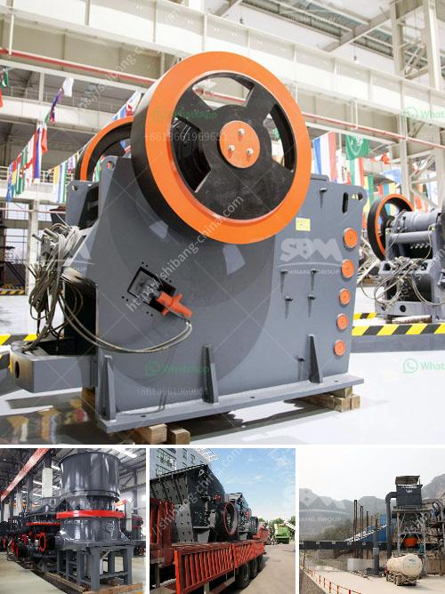

<h3>sand washing equipment for sale</h3>
Sand washing equipment is essential for ensuring clean and safe sand for construction and other industries. With the increasing demand for quality sand in various applications, the need for efficient sand washing equipment has become paramount.

Sand washing equipment utilizes a washing process to cleanse and separate impurities from sand, ensuring that the resulting sand is of high quality. It is particularly beneficial for removing clay and other unwanted particles that can affect the strength and durability of the sand.

One of the most popular types of sand washing equipment for sale is the spiral sand washer. This equipment uses a spiral to agitate and scrub the sand, removing impurities and separating them from the clean sand. The spiral sand washer is highly effective in removing clay and other contaminants, resulting in clean and well-graded sand.

Another commonly used sand washing equipment is the wheel sand washer. This equipment uses a wheel to propel and wash the sand, removing impurities in the process. The wheel sand washer is compact and efficient, making it suitable for various applications, such as concrete production, sand making, and road construction.

When purchasing sand washing equipment, it is important to consider factors such as capacity, water consumption, power consumption, and maintenance requirements. Additionally, it is advisable to choose equipment from reputable manufacturers to ensure reliable performance and durability.

Various suppliers offer sand washing equipment for sale, providing a wide range of options to suit different requirements. Buyers can choose from different sizes, capacities, and configurations, depending on their specific needs. It is crucial to carefully evaluate the specifications and features of the equipment before making a purchase to ensure it is suitable for the intended application.

In conclusion, sand washing equipment plays a crucial role in producing clean and high-quality sand for construction and other industries. With various types and models available for sale, buyers can find the right equipment to meet their specific requirements. By investing in reliable and efficient sand washing equipment, businesses can ensure the production of top-grade sand, resulting in improved product quality and increased customer satisfaction.
<h3>Contact us</h3><ul><li><strong>Whatsapp:&nbsp;<a href="https://wa.me/8613661969651">+8613661969651</a></strong></li><li><a href="https://swt.shibang-china.com/?git&amp;zhl&amp;sand washing equipment for sale"><strong>Online Service(chat now)</strong></a></li></ul><h3>Related</h3><ul><li><a href='sand screen with vibrator.md'>sand screen with vibrator</a></li><li><a href='stone crusher for rent.md'>stone crusher for rent</a></li><li><a href='construction equipment made in taiwan.md'>construction equipment made in taiwan</a></li><li><a href='rock crusher for crushing balsalt stone.md'>rock crusher for crushing balsalt stone</a></li><li><a href='price list of grinding equipment for sale.md'>price list of grinding equipment for sale</a></li></ul>