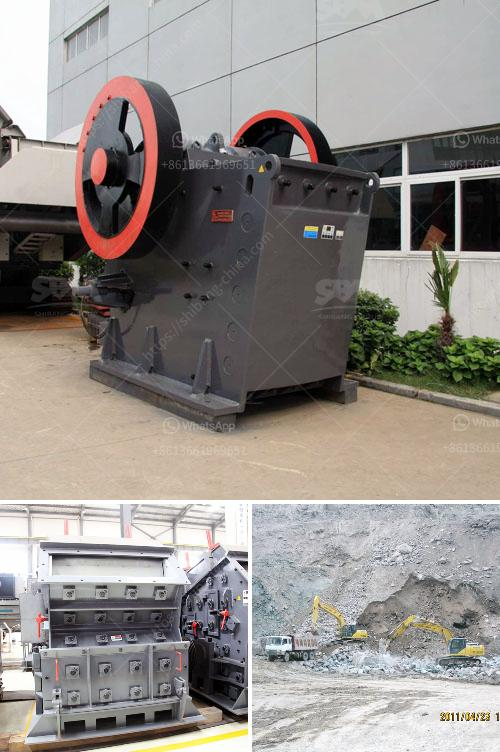

<h3>sayaji jaw crusher manufacturer</h3>
India has established itself as a leading country in the mining industry. Over the years, countless efforts have been made to improve the mining process. Machines have been designed to increase production, reduce downtime, and ensure the safety of workers. One such innovation is the Sayaji jaw crusher.

Sayaji Jaw Crusher Manufacturer, a company established in 1941, is a major player in the fields of mining and construction machinery. It has a rich history of manufacturing and exporting a wide range of equipment.

The company is focused on addressing the needs of both the domestic and international markets. It has a state-of-the-art manufacturing facility in Vadodara, Gujarat, which is equipped with modern machines and technology to produce world-class equipment.

The Sayaji jaw crusher is known for its heavy-duty nature. It effortlessly crushes the hardest materials, especially rocks, into a granular form. Sayaji has carried out extensive research to design and manufacture crushers ideal for Indian conditions.

With its high-quality products and effective after-sales support, Sayaji has become the preferred choice of many mining and construction companies in India.

The jaw crushers manufactured by Sayaji are reliable, durable, and have a long service life. They are built to withstand heavy-duty applications and can handle high volumes of material. Sayaji jaw crushers are designed with an emphasis on ease of operation and maintenance.

The jaw crusher comes with an easy-to-use control panel that allows for quick and efficient adjustments to the machine settings. It also features a hydraulic system that ensures smooth and hassle-free operation.

One of the key features of a Sayaji jaw crusher is its ability to crush materials of different sizes and types. The machine can handle everything from soft to hard materials, making it versatile for various applications.

Another advantage of the Sayaji jaw crusher is its low energy consumption. The machine requires less power to operate, which translates into significant cost savings for the user. Additionally, the jaw crusher produces less noise and vibration, ensuring a comfortable working environment.

Sayaji prides itself on its commitment to customer satisfaction. The company offers prompt and efficient after-sales service, ensuring that any issues with the equipment are resolved in a timely manner. Sayaji also provides training and support to its customers to maximize the productivity and efficiency of the jaw crusher.

In conclusion, Sayaji Jaw Crusher Manufacturer is a reputable company with a rich history of manufacturing jaw crushers. The machines are built to last and are known for their durability and reliability. Sayaji is focused on providing fast and efficient after-sales services to its customers, ensuring that their equipment is up and running in no time. With its high-quality products and innovative solutions, Sayaji is truly a leading player in the mining and construction industry in India.
<h3>Contact us</h3><ul><li><strong>Whatsapp:&nbsp;<a href="https://wa.me/8613661969651">+8613661969651</a></strong></li><li><a href="https://swt.shibang-china.com/?git&amp;zhl&amp;sayaji jaw crusher manufacturer"><strong>Online Service(chat now)</strong></a></li></ul><h3>Related</h3><ul><li><a href='stone crusher mobile plant di indonesia.md'>stone crusher mobile plant di indonesia</a></li><li><a href='manufacturer of crusher plant of bajri from rajkot.md'>manufacturer of crusher plant of bajri from rajkot</a></li><li><a href='safety operation of crusher.md'>safety operation of crusher</a></li><li><a href='stone crushing machines for brick making.md'>stone crushing machines for brick making</a></li><li><a href='used carbon grinding production line.md'>used carbon grinding production line</a></li></ul>