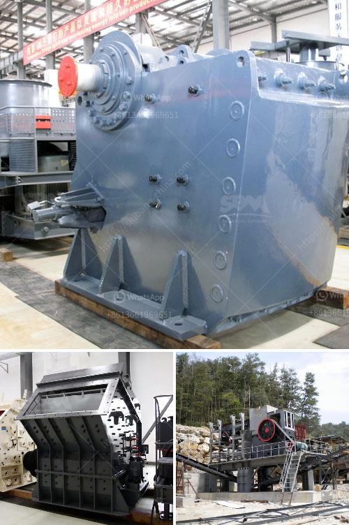

<h3>sayaji jaw crusher vadodara</h3>
Sayaji Jaw Crusher Vadodara is known for its distinct features such as excellent strength, efficient balance, high-endurance and error-free operation. The sturdy design of this jaw crusher is facilitated by a well-designed mechanical system that produces noiseless operation with high output power. Its important components include a rotating body, an eccentric shaft, a fixed jaw plate, a movable jaw plate, a toggle plate, an adjustable discharge opening, an adjusting device, and a driving motor.

One of the key features of the Sayaji Jaw Crusher Vadodara is its built-in safety device. This device acts as a protection mechanism for the entire jaw crusher system, preventing unauthorized access and ensuring the safety of the operators. It also provides protection against overload, protecting the equipment from excessive strain and damage.

Another notable feature of the Sayaji Jaw Crusher Vadodara is its ability to easily adjust the discharge opening. This feature allows users to regulate the size of the material being crushed according to their specific requirements. The adjustable discharge opening not only enhances the flexibility of the crusher but also improves its overall performance by ensuring a consistent and uniform product size.

The Sayaji Jaw Crusher Vadodara is also known for its excellent performance and high productivity. Powered by a robust motor, this crusher is capable of delivering high crushing efficiency, even under challenging conditions. It is designed to handle a wide range of materials, from soft to hard, and can easily crush various types of stones, ores, minerals, and rocks with varying levels of hardness.

Apart from its exceptional performance, the Sayaji Jaw Crusher Vadodara also offers superior durability and longevity. Built with high-quality materials and precision engineering, this crusher is designed to withstand heavy-duty applications and harsh working environments. It is built to last, ensuring consistent performance throughout its long operational life.

The Sayaji Jaw Crusher Vadodara is widely used in mining, metallurgy, construction, highway, railway, water conservancy, chemical industry, and other industries, making it suitable for various types of stones and ores with different hardness levels. It is highly versatile, capable of crushing a wide range of materials, and offers reliable performance for a multitude of applications.

In conclusion, the Sayaji Jaw Crusher Vadodara is an impressive and reliable piece of equipment that offers exceptional strength, high productivity, and exceptional durability. Its advanced features and precise engineering ensure efficient and error-free operation, making it a valuable asset for any crushing operation. Whether used in mining, construction, or any other industry, this jaw crusher delivers superior performance and long-lasting durability.
<h3>Contact us</h3><ul><li><strong>Whatsapp:&nbsp;<a href="https://wa.me/8613661969651">+8613661969651</a></strong></li><li><a href="https://swt.shibang-china.com/?git&amp;zhl&amp;sayaji jaw crusher vadodara"><strong>Online Service(chat now)</strong></a></li></ul><h3>Related</h3><ul><li><a href='process of preparing clay crusher.md'>process of preparing clay crusher</a></li><li><a href='brand new stone crusher for sale in the philippines.md'>brand new stone crusher for sale in the philippines</a></li><li><a href='calculation of cement ball mill capacity.md'>calculation of cement ball mill capacity</a></li><li><a href='quote for sand making machine.md'>quote for sand making machine</a></li><li><a href='quarry crusher equipment manufacturer in turkey.md'>quarry crusher equipment manufacturer in turkey</a></li></ul>