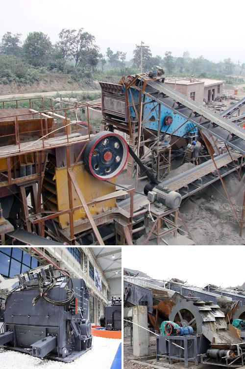

<h3>screening and crushing solutions</h3>
Screening and Crushing Solutions: Enhancing Efficiency and Productivity in the Mining and Construction Industries

The mining and construction industries are crucial sectors that contribute significantly to the overall economic growth and development of a nation. These industries involve the extraction and processing of minerals, stones, and other materials vital for various applications.

When it comes to the efficient extraction and processing of raw materials, screening and crushing solutions play a crucial role. These solutions effectively sift and crush large rocks, stones, and ores into smaller particles, ensuring that the desired material size and quality are met for further processing and utilization.

Screening solutions involve the use of screens or sieves to separate different-sized particles based on their sizes and shapes. This process allows the retrieval of valuable materials, while the unwanted or undersized particles are discarded. On the other hand, crushing solutions involve the use of crushers or crushers. These machines apply mechanical force to break down large rocks, stones, or ores into smaller, manageable sizes.

One of the key benefits of screening and crushing solutions is the enhancement of efficiency in the extraction and processing of materials. By effectively separating particles of different sizes, these solutions ensure that the desired material is processed accurately, minimizing the need for manual sorting and reducing wastage of resources. This, in turn, results in cost savings for mining and construction companies, as well as improved productivity.

Moreover, screening and crushing solutions contribute to improved productivity in the mining and construction industries. With the ability to process materials consistently and efficiently, these solutions enable more output to be generated within a given timeframe. By maximizing the extraction and processing of raw materials, companies can meet customer demands and deadlines effectively, without compromising on quality.

In addition to their efficiency and productivity benefits, screening and crushing solutions also offer various technical advantages. For instance, advanced screening technologies allow for accurate sizing and classification of materials, ensuring the production of consistent and uniform end products. Similarly, modern crushing machines provide precise control over the crushing process, resulting in optimal particle sizes suitable for downstream applications.

Another significant advantage of screening and crushing solutions is their ability to improve the quality and value of the final products. By eliminating impurities and producing uniform sizes, these solutions help mining and construction companies meet the required specifications and standards set by their customers or regulatory bodies. This, in turn, enhances the market value of the produced materials, positively impacting the profitability of the business.

Furthermore, screening and crushing solutions contribute to the sustainable development of the mining and construction industries. Through their efficient and responsible processing methods, these solutions minimize the environmental impacts associated with the extraction and processing of raw materials. By reducing material wastage, optimizing energy consumption, and implementing sound pollution control measures, companies can minimize their carbon footprint and contribute to a more sustainable future.

In conclusion, screening and crushing solutions are integral to the mining and construction industries. These solutions enhance efficiency, productivity, and quality in the extraction and processing of raw materials, while also promoting sustainability. As advancements in technology continue to drive innovation in this field, it is expected that screening and crushing solutions will further evolve, enabling even greater optimization and cost-effectiveness in the industry.
<h3>Contact us</h3><ul><li><strong>Whatsapp:&nbsp;<a href="https://wa.me/8613661969651">+8613661969651</a></strong></li><li><a href="https://swt.shibang-china.com/?git&amp;zhl&amp;screening and crushing solutions"><strong>Online Service(chat now)</strong></a></li></ul><h3>Related</h3><ul><li><a href='gold mining and washing machine usa.md'>gold mining and washing machine usa</a></li><li><a href='stasioner stone crusher.md'>stasioner stone crusher</a></li><li><a href='artificial stone production line floor.md'>artificial stone production line floor</a></li><li><a href='iron ore beneficiation plant consultants in india.md'>iron ore beneficiation plant consultants in india</a></li><li><a href='crusher machine manufacturers in pakistan.md'>crusher machine manufacturers in pakistan</a></li></ul>