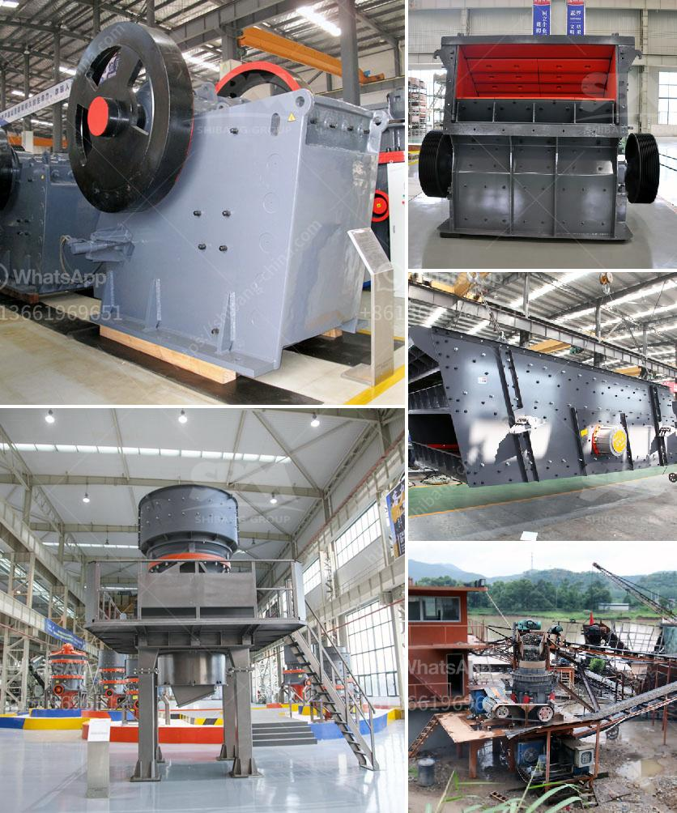

<h3>second hand ball mill for sale in philippines</h3>
If you are working on a mining site, dig site, or excavation project and need high quality grinding for ore, chemicals and ceramic raw materials check out our wide selection of high quality ball mills. We carry some of the top names in the grinding machine business including Kobe-Allis, Denver, Metso and Allis-Chalmers and offer great prices on both new and used ball mills.

The internal cascading effect of a ball mill is used to turn mining ore into fine powders and ball mills are often used as the key milling equipment after material has been crushed. Ball mills are used in a wide range of material processing industries including cement, silicate, new-type building material, refractory material, fertilizer, ore dressing of ferrous metal and non-ferrous metal, glass ceramics, etc.

Ball mills can grind wet or dry and can be continuous or batch type mills. Continuous mills have either a grate dischage or overflow discharge.

A ball mill is a type of grinder used to grind materials into extremely fine powder for use in mineral dressing processes, paints, pyrotechnics, ceramics and selective laser sintering. The ball mill is a key piece of equipment for grinding crushed materials, and it is widely used in production lines for powders such as cement, silicates, refractory material, fertilizer, glass ceramics, etc. as well as for ore dressing of both ferrous and non-ferrous metals.

We buy, sell and consign Ball Mills of leading manufacturers like Metso (Allis Chalmers, Dominion, Denver, Hardinge, Eimco), FLSmidth, Outotek and many more. Please click here for complete ore processing plants. The ball mill grind various ores and other materials either wet or dry. There are two kinds of ball mill, grate type and overfall type due to different ways of discharging material. There are many types of grinding media suitable for use in a ball mill, including ceramic balls, flint pebbles, and stainless steel balls. Please contact us if you are looking to buy or sell a ball mill.

Learn more about the ball mills and how these grinding machines work by reading our detailed technical article. Over a period of many years, various fine grinding machines have been developed and used, but the ball mill has become standard due to its simplicity and low operating cost.

Investing in second-hand equipment can save you money compared to buying new, enabling you to maximize your resources and benefit from a lower initial investment cost. Our second-hand ball mills are used for various minerals and ores grinding and regrinding operations in many countries where the mining industry is flourishing.

In the Philippines, we have multiple mining sites operating in different provinces, which include mine sites in Aklan, Cebu, Negros, and Zambales to name a few. Our company is continuously sourcing used ball mills to grind ores and minerals, as we have done for more than 30 years.

Second-hand ball mill sales can be hard to find within the Philippines. There is usually no shortage of these grinding machines, as there are always new and second-hand available as options. However, there are only a few sellers of such equipment in the country.

If you are in need of a second-hand ball mill for your business, we recommend reaching out to suppliers, importers, and manufacturers. These suppliers may have years of experience in providing quality equipment, and they may offer competitive prices for used ball mills in good condition.

In conclusion, investing in a second-hand ball mill for your facility may greatly increase your operational efficiency and production capacity, as well as reducing energy consumption and lowering your costs. Don't hesitate to explore the market and reach out to reliable suppliers to inquire about the availability of second-hand ball mills for sale in the Philippines.
<h3>Contact us</h3><ul><li><strong>Whatsapp:&nbsp;<a href="https://wa.me/8613661969651">+8613661969651</a></strong></li><li><a href="https://swt.shibang-china.com/?git&amp;zhl&amp;second hand ball mill for sale in philippines"><strong>Online Service(chat now)</strong></a></li></ul><h3>Related</h3><ul><li><a href='gypsum grinding machine plant.md'>gypsum grinding machine plant</a></li><li><a href='250 mesh hammer mill.md'>250 mesh hammer mill</a></li><li><a href='quotation for crusher.md'>quotation for crusher</a></li><li><a href='crusher for rent in malaysia.md'>crusher for rent in malaysia</a></li><li><a href='sewa stone crusher plant.md'>sewa stone crusher plant</a></li></ul>