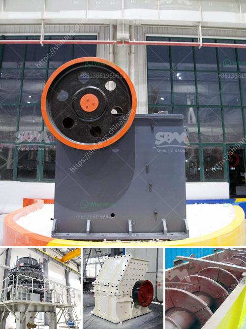

<h3>second hand diesel hammer mill for sale south africa</h3>
Second-hand diesel hammer mills are an affordable option for buyers looking to purchase a reliable machine without breaking the bank. These machines have been previously used but are still in good working condition, making them a popular choice in South Africa.

Diesel hammer mills are powered by diesel fuel, which makes them versatile and ideal for areas without access to electricity. They can be used for a variety of applications such as crushing grain for animal feed, grinding maize, or even mulching garden waste.

When shopping for second-hand diesel hammer mills, there are a few things to consider. First, check the overall condition of the machine. Look for any signs of wear, such as rust or damage, and make sure all parts are in working order. It's also a good idea to ask about the machine's history, including how often it was used and for what purposes.

Another important factor to consider is the size and capacity of the hammer mill. Depending on your specific needs, you may require a machine with a larger or smaller capacity. A mill with a higher horsepower will have a greater grinding capacity, allowing you to process more material in a shorter amount of time.

It's also helpful to inquire about the maintenance and servicing history of the machine. A well-maintained hammer mill is likely to have a longer lifespan and be more reliable in the long run. Consider asking the seller for any maintenance records and whether they have performed regular servicing and repairs.

One of the advantages of purchasing a second-hand diesel hammer mill is the cost savings. Used machines are typically priced lower than brand new ones, making them a more affordable option. This is especially beneficial for small businesses or individuals who are just starting out and want to invest in a reliable machine without spending too much money.

In addition to cost savings, buying second-hand also helps to reduce waste and promote sustainability. By giving a used machine a second life, you are preventing it from going to a landfill and reducing the demand for new equipment production.

To find second-hand diesel hammer mills for sale in South Africa, there are several avenues you can explore. Online classifieds websites, such as Gumtree or OLX, often have a range of listings from private sellers or dealerships. You can also check with local agricultural equipment suppliers, as they may occasionally have used machines available.

Before making a purchase, it's a good idea to compare prices and conditions from different sellers. This will help you make an informed decision and ensure you are getting the best value for your money. Don't forget to factor in any additional costs, such as shipping or transportation, when comparing prices.

In conclusion, second-hand diesel hammer mills are a practical and cost-effective option for those looking to invest in a reliable machine. By considering factors such as condition, size, capacity, and maintenance history, you can find a quality machine that meets your needs without breaking the bank. Whether you're a small business or an individual, buying used equipment not only saves you money but also promotes sustainability by giving these machines a second life.
<h3>Contact us</h3><ul><li><strong>Whatsapp:&nbsp;<a href="https://wa.me/8613661969651">+8613661969651</a></strong></li><li><a href="https://swt.shibang-china.com/?git&amp;zhl&amp;second hand diesel hammer mill for sale south africa"><strong>Online Service(chat now)</strong></a></li></ul><h3>Related</h3><ul><li><a href='belt conveyor calculation sheet.md'>belt conveyor calculation sheet</a></li><li><a href='stone crusher factory.md'>stone crusher factory</a></li><li><a href='correct feed of cone crushers.md'>correct feed of cone crushers</a></li><li><a href='coltan milling equipment in south africa.md'>coltan milling equipment in south africa</a></li><li><a href='crusher plant in tarlac.md'>crusher plant in tarlac</a></li></ul>