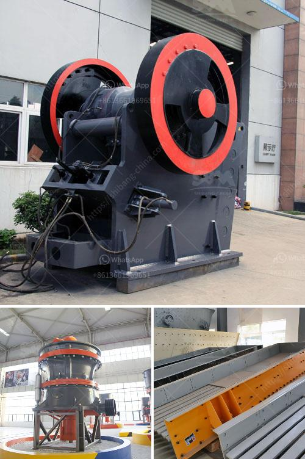

<h3>second hand gold mining equipments in uk</h3>
The gold mining industry is a lucrative one, and with the rising demand for the precious metal, the need for mining equipment has never been greater. However, purchasing brand new equipment can be expensive, especially for small-scale miners and prospectors. In the United Kingdom, this has led to a thriving market for second hand gold mining equipment, which allows miners of all sizes to access the necessary tools at affordable prices.

The UK boasts a rich history of gold mining, with significant deposits found throughout the country. From hobbyists and weekend prospectors to commercial miners, the demand for mining equipment is high. Second hand gold mining equipment provides interested individuals and businesses with an opportunity to enter the market or expand their operations without breaking the bank.

Purchasing used gold mining equipment offers several advantages over buying new. Firstly, the cost savings can be substantial, allowing miners to allocate their resources more efficiently. Secondly, second hand equipment often retains its functionality, ensuring that miners can begin operations immediately without any delay or additional investments.

By investing in second hand equipment, miners are also contributing to sustainability efforts. Reusing mining machinery reduces the need for production of new equipment, resulting in a more environmentally friendly mining industry. Additionally, efficient utilization of existing resources minimizes waste and promotes responsible mining practices.

Finding reliable second hand gold mining equipment suppliers in the UK has become easier in recent years. There are numerous online platforms, auctions, and specialized marketplaces that connect sellers and buyers, offering a wide range of equipment options to suit various budgets and requirements. Comprehensive descriptions and detailed photographs ensure transparency and enable potential buyers to make informed decisions.

The market for second hand gold mining equipment in the UK is thriving, providing miners with a cost-effective solution to access the necessary tools and machinery. By opting for used equipment, miners can support sustainability and responsible mining practices while also maximizing their profits. Whether for hobbyist gold panning or large-scale commercial operations, exploring the second hand market is an excellent avenue to enter or expand within the gold mining industry.
<h3>Contact us</h3><ul><li><strong>Whatsapp:&nbsp;<a href="https://wa.me/8613661969651">+8613661969651</a></strong></li><li><a href="https://swt.shibang-china.com/?git&amp;zhl&amp;second hand gold mining equipments in uk"><strong>Online Service(chat now)</strong></a></li></ul><h3>Related</h3><ul><li><a href='crushing plant manufacturers.md'>crushing plant manufacturers</a></li><li><a href='small scale coal processing plant.md'>small scale coal processing plant</a></li><li><a href='gold milling equipment prices.md'>gold milling equipment prices</a></li><li><a href='mobile stone crusher from taiwan.md'>mobile stone crusher from taiwan</a></li><li><a href='stone crusher used for sale spain.md'>stone crusher used for sale spain</a></li></ul>