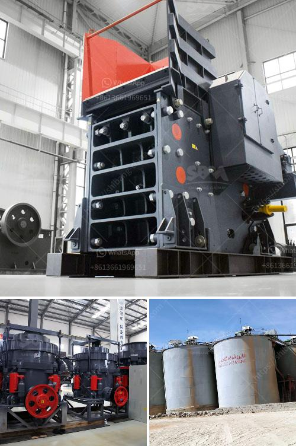

<h3>second hand jaw crusher for sale in malaysia</h3>
Second hand jaw crushers are a great investment for businesses and individuals alike. They offer a cost-effective way to increase production capacity or start new projects without compromising quality. At the same time, they also reduce waste and environmental impact. In Malaysia, second hand jaw crusher for sale is mainly used for various rock and ore primary crushing operations.

Considering the important role that jaw crushers play in mining operations, it is not surprising that they are available in a wide range of configurations and sizes to suit different applications. The most common sizes are:

1. Single-toggle jaw crusher: These types of machines are commonly used in mines due to their ability to crush tough and abrasive materials. They are usually used as primary crushers.

2. Double-toggle jaw crusher: In this type of crusher, the swing jaw is suspended on the eccentric shaft, which allows a lighter, more compact design than with the double-toggle machine.

3. Mobile jaw crusher: As the name suggests, this type of jaw crusher is designed to be moved around on wheels or on tracks. It is designed to reduce the size of large rocks into smaller rocks or gravel.

Before purchasing a second-hand jaw crusher in Malaysia, make sure to check the machine thoroughly. Look for any signs of wear or damage, and ask about the machine's history and previous usage. It is also important to ensure that all components and parts are in good working condition. This will help to ensure smooth and efficient operation, as well as minimize the risk of breakdowns and downtime.

In conclusion, second-hand jaw crushers are a great investment for businesses and individuals who need to increase production capacity or start new projects without breaking the bank. With their many advantages and versatility, they offer an affordable and efficient solution for crushing various rock and minerals. Whether you are in the mining industry or any other field that requires crushing equipment, a second-hand jaw crusher is worth considering.
<h3>Contact us</h3><ul><li><strong>Whatsapp:&nbsp;<a href="https://wa.me/8613661969651">+8613661969651</a></strong></li><li><a href="https://swt.shibang-china.com/?git&amp;zhl&amp;second hand jaw crusher for sale in malaysia"><strong>Online Service(chat now)</strong></a></li></ul><h3>Related</h3><ul><li><a href='cement mill plant design drawings.md'>cement mill plant design drawings</a></li><li><a href='hammer mill grinder for sale in dubai.md'>hammer mill grinder for sale in dubai</a></li><li><a href='belt conveyor europe.md'>belt conveyor europe</a></li><li><a href='operating parameter of vertical roller mill.md'>operating parameter of vertical roller mill</a></li><li><a href='how to setting up of stone crusher unit.md'>how to setting up of stone crusher unit</a></li></ul>