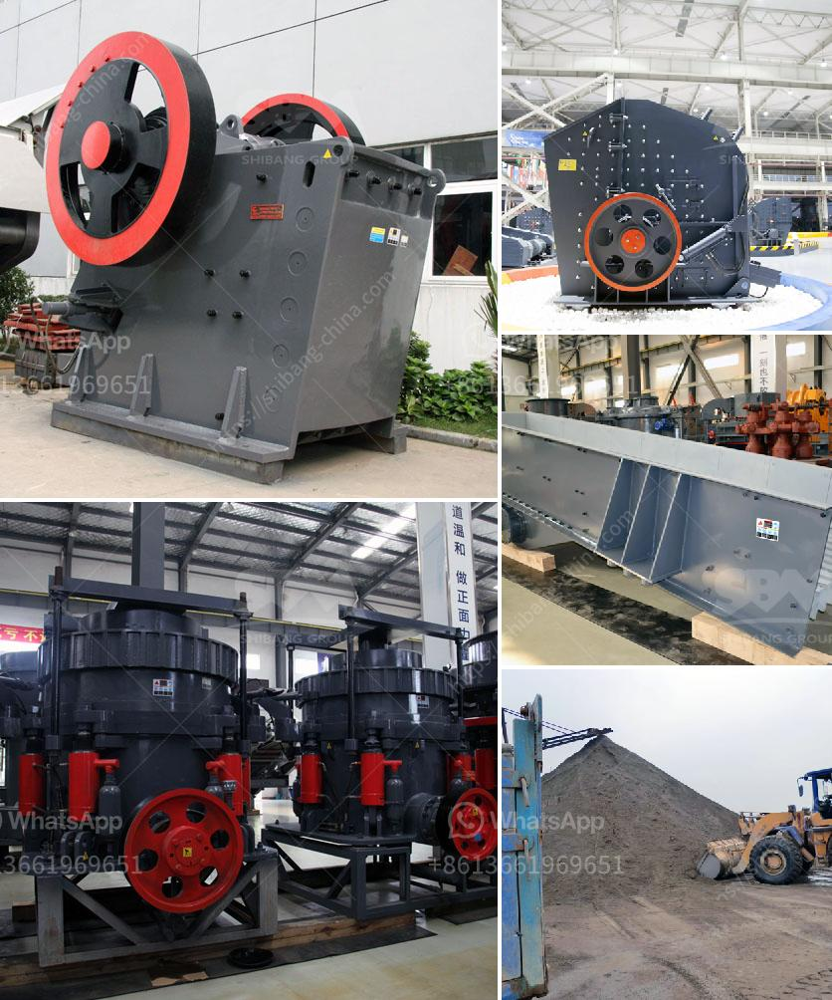

<h3>second hand mobile crusher plant in india</h3>
Second-hand mobile crusher plant in India is increasingly common in recent years. With the rapid development of the Indian economy, more and more projects need to be built to meet the demand for infrastructure construction. So the demand for second-hand mobile crusher plants is very robust.

The second-hand mobile stone crusher plant in India is based on the traditional crusher machine and it combines the high technology of domestic and abroad crushing technology. Nowadays, the second-hand mobile stone crusher plant in India is popular with the small scale mining industry and individual mining operators.

It is may be stated as a high-skilled and good performance machine with a low cost of investment. For more convenience, the mobile stone crusher can be moved frequently to keep up with the mining sites, which is named as the mobile crusher plant.

Compared with the traditional fixed crusher machines, the mobile crusher plant has a longer use life and can save a lot of manpower and material resources. Moreover, it costs less money than a fixed crusher station. So, what are the common advantages of second-hand mobile crusher plant?

Firstly, it eliminates the obstacles of the crushing site and environment. The mobile crusher plant can crush materials at primary site and remove transportation from the primary site to crushing place. It ensures to save a lot of transportation costs.

Secondly, the plant sends the material evenly to the crusher. As the crusher, the rock materials are sent to impact crusher or cone crusher by belt conveyor for secondary crushing. Then the materials are washed by sand washer, and crushed further by the third crusher.

Thirdly, the crushed stone materials are sent to the vibrating screen to separate different sizes for further crushing or for end use. According to customers' requirements, the finished products can be graded and separated into different specifications.

Overall, the second-hand mobile crusher plant in India plays an important role in the whole mining process. It is specially designed and produced for waste material use. If you want to get the high quality mining products, please contact Zenith, who can provide you the advanced and high technology machine.

In conclusion, the mobile crusher plant is usually considered as a necessary equipment in the waste disposal production line, especially for mine waste material. It is widely used in the whole mining process. If you want to buy the second-hand mobile crusher plant, please contact us. We will provide you the best service.
<h3>Contact us</h3><ul><li><strong>Whatsapp:&nbsp;<a href="https://wa.me/8613661969651">+8613661969651</a></strong></li><li><a href="https://swt.shibang-china.com/?git&amp;zhl&amp;second hand mobile crusher plant in india"><strong>Online Service(chat now)</strong></a></li></ul><h3>Related</h3><ul><li><a href='cement plant business plan.md'>cement plant business plan</a></li><li><a href='kenya granite stone crushing plant.md'>kenya granite stone crushing plant</a></li><li><a href='gypsum powder plant india.md'>gypsum powder plant india</a></li><li><a href='quartz grit making machine.md'>quartz grit making machine</a></li><li><a href='coconut shell powder making machine grinding mill for sale.md'>coconut shell powder making machine grinding mill for sale</a></li></ul>