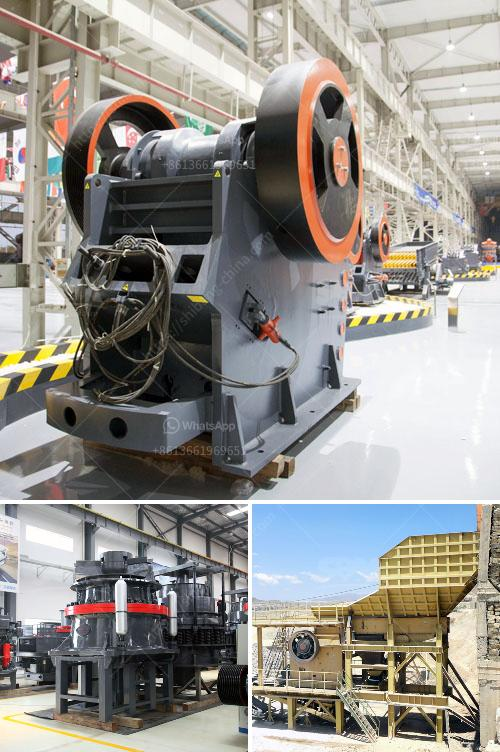

<h3>second hand quarry equipment price philippines</h3>
Second-hand quarry equipment is a smart and cost-effective choice when you are in need of equipment for your quarry operations. Quarrying activities can be demanding and at times, require heavy machinery. Purchasing second-hand equipment can save you a significant amount of money, especially when compared to buying brand new machinery.

When it comes to the Philippines, second-hand quarry equipment is widely available and offers a great opportunity for those in the mining industry. Quarrying equipment often operates in tough and challenging conditions, which is why it is essential to choose reliable and durable machinery. Second-hand equipment that has been properly maintained can still provide outstanding performance.

Price is a crucial factor for quarry owners, and second-hand equipment can be a more economical choice, particularly for smaller operations or start-ups. The cost of buying new machinery can be exorbitant, but second-hand equipment offers more affordable options without compromising quality. This affordability can free up financial resources that can be utilized for other essential aspects of the business.

The price of second-hand quarry equipment in the Philippines varies depending on various factors. These include the age and condition of the machinery, the brand, the capacity, and other specifications. It is always recommended to thoroughly inspect the equipment and test its performance before making a purchase. While some wear and tear are to be expected with second-hand equipment, it is essential to ensure that the machinery is still in good working condition and can meet the demands of your quarry operations.

The availability of second-hand quarry equipment in the Philippines is beneficial for both buyers and sellers. For sellers looking to upgrade their equipment or exit the industry, selling second-hand machinery provides an opportunity to recover some of their initial investment. Buyers, on the other hand, gain access to well-maintained machinery at a lower price point than buying new equipment.

To find second-hand quarry equipment in the Philippines, there are several avenues you can explore. Online marketplaces and dedicated websites for used machinery are excellent resources. Local dealerships and auctions can also be good places to find second-hand equipment. It's important to research and compare prices from different sources to ensure you get the best value for your money.

When purchasing second-hand quarry equipment, it is essential to do your due diligence. Arrange for a physical inspection of the machinery and engage an expert to evaluate its condition. Checking the equipment's service history, maintenance records, and any available warranties can provide additional peace of mind.

In conclusion, buying second-hand quarry equipment in the Philippines is a practical and cost-effective solution for quarry owners and operators. It allows them to acquire reliable machinery at a lower cost, enabling them to allocate their funds more efficiently. With proper research and inspection, second-hand equipment can provide long-lasting and excellent performance for quarrying operations.
<h3>Contact us</h3><ul><li><strong>Whatsapp:&nbsp;<a href="https://wa.me/8613661969651">+8613661969651</a></strong></li><li><a href="https://swt.shibang-china.com/?git&amp;zhl&amp;second hand quarry equipment price philippines"><strong>Online Service(chat now)</strong></a></li></ul><h3>Related</h3><ul><li><a href='tph stationery stone crushing plant.md'>tph stationery stone crushing plant</a></li><li><a href='crushing machines in bolivia.md'>crushing machines in bolivia</a></li><li><a href='roll mill manufacturere in mumbai.md'>roll mill manufacturere in mumbai</a></li><li><a href='hydraulic roll crusher zenith.md'>hydraulic roll crusher zenith</a></li><li><a href='gypsum board machinery turkey manufacturers.md'>gypsum board machinery turkey manufacturers</a></li></ul>