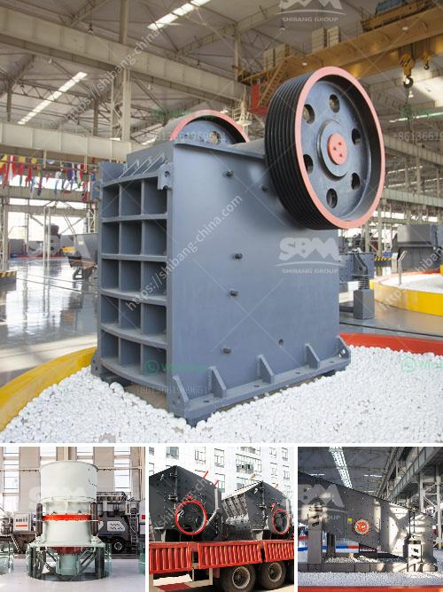

<h3>secondary crushing cone crusher drawings</h3>
Secondary crushing cone crushers play a crucial role in the production of aggregates and other materials used in various industries. In this article, we will take a closer look at the designs and drawings of these machines, giving you an insight into their internal workings.

The primary function of a secondary crushing cone crusher is to reduce the size of materials that have been quarried or mined. These materials typically include rock, ore, and minerals. The cone crusher achieves this by using a mantle, which gyrates within a concave bowl. As the mantle rotates, it crushes the material against the stationary concave, resulting in the desired product size.

The detailed drawings of a secondary crushing cone crusher show various components, including the cone head, concave, mantle, eccentric assembly, bowl liner, and transmission system. These drawings provide a comprehensive view of the machine's construction, enabling engineers and operators to understand the intricacies of its operation. Additionally, these drawings are crucial in the manufacturing process, ensuring that each component is properly designed and fabricated to meet the required specifications.

In recent years, advancements in technology have led to the development of more efficient cone crusher designs. These improvements have focused on enhancing the crushing process, reducing energy consumption, and increasing productivity. The cone crusher drawings reflect these advancements, featuring innovative designs that optimize the crushing performance.

Secondary crushing cone crushers are widely used in industries such as mining, quarrying, and construction. They are essential for processing materials into smaller, more manageable sizes for further downstream processing. Understanding the detailed drawings of these machines can help optimize their operation and maintenance, ensuring efficient and reliable performance.

In conclusion, secondary crushing cone crusher drawings provide valuable insights into the internal workings of these machines. By understanding their designs and construction, engineers and operators can make informed decisions about their operation and maintenance. The advancements in cone crusher design have resulted in more efficient and productive machines that are vital in various industries.
<h3>Contact us</h3><ul><li><strong>Whatsapp:&nbsp;<a href="https://wa.me/8613661969651">+8613661969651</a></strong></li><li><a href="https://swt.shibang-china.com/?git&amp;zhl&amp;secondary crushing cone crusher drawings"><strong>Online Service(chat now)</strong></a></li></ul><h3>Related</h3><ul><li><a href='buy crusher of pact in peru.md'>buy crusher of pact in peru</a></li><li><a href='mobile crushing unit.md'>mobile crushing unit</a></li><li><a href='company that work in crushing stones.md'>company that work in crushing stones</a></li><li><a href='cement mill liner manufacturers in india.md'>cement mill liner manufacturers in india</a></li><li><a href='silica washing plant.md'>silica washing plant</a></li></ul>