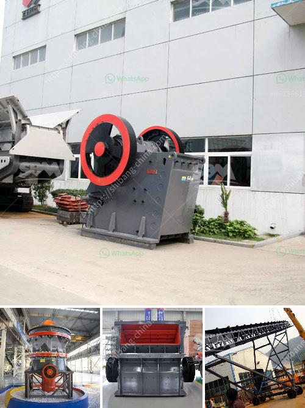

<h3>secondary rock crusher</h3>
A secondary rock crusher is used to crush medium-sized rocks into smaller pieces. They are generally used for the second stage of material reduction in various industries like mining, construction, and cement production. Secondary crushers have a feed size range of 300-500mm and provide a high percentage of fines due to their high impact force.

The rocks fed into the secondary crusher undergo crushing in a series of steps. The oversized materials are first broken down by large hammers and are then further reduced by smaller hammers. These hammers have a high impact force and are designed to break down rocks efficiently.

One of the primary advantages of a secondary rock crusher is the ability to produce high quality and consistent end products. The crushed material is typically well-shaped and of uniform size, which makes it suitable for various applications. Additionally, secondary crushers have a higher reduction ratio compared to primary crushers, which means they can produce more fine particles.

Secondary rock crushers are commonly used in the mining industry for reducing damp and sticky ore. These machines are designed to handle wet, sticky materials, making them ideal for crushing clay, shale, and bauxite. In recent years, advancements in wear-resistant materials have further improved secondary crusher efficiency, allowing them to handle even the toughest ores with ease.

Depending on the application, secondary crushers can be operated in either open or closed circuit. Open-circuit crushing allows the material to be broken down only once, while closed-circuit crushing allows the material to undergo multiple passes before reaching the desired size. This flexibility allows for greater control over the final product and can effectively reduce the amount of oversize material.

Secondary rock crushers are typically powered by electric motors or diesel engines. This makes them suitable for use in remote locations where access to a reliable power source may be limited. With advancements in technology, many secondary crushers now feature intelligent control systems that optimize performance and reduce downtime.

Safety is a crucial factor when operating a secondary rock crusher. Proper training and adherence to safety protocols are essential to prevent accidents and ensure the well-being of operators. Additionally, regular maintenance and inspections are necessary to keep the equipment running smoothly and to identify any potential issues that may impact performance.

In conclusion, a secondary rock crusher plays a vital role in the production of high-quality end products. They are versatile machines that can handle a wide range of materials and can be customized to suit specific needs. With advancements in technology, these crushers continue to evolve, providing greater efficiency, reliability, and safety in various industries.
<h3>Contact us</h3><ul><li><strong>Whatsapp:&nbsp;<a href="https://wa.me/8613661969651">+8613661969651</a></strong></li><li><a href="https://swt.shibang-china.com/?git&amp;zhl&amp;secondary rock crusher"><strong>Online Service(chat now)</strong></a></li></ul><h3>Related</h3><ul><li><a href='conveyor belt supplier in riyadh.md'>conveyor belt supplier in riyadh</a></li><li><a href='black granite land for sale in tamilnadu.md'>black granite land for sale in tamilnadu</a></li><li><a href='pebble crushing processing.md'>pebble crushing processing</a></li><li><a href='mini cement plant for sale in india.md'>mini cement plant for sale in india</a></li><li><a href='talc mining crusher process.md'>talc mining crusher process</a></li></ul>