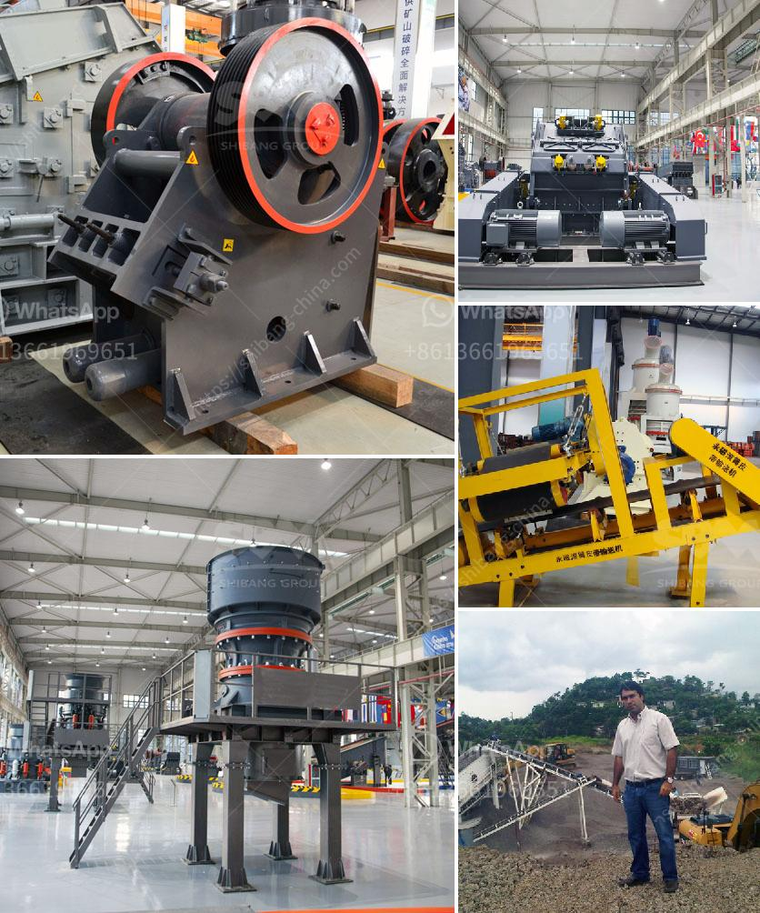

<h3>sell stone crusher</h3>
Selling a stone crusher is a lucrative and profitable venture for anyone who is interested in the mining industry or construction business. This kind of machine is capable of crushing large rocks into small and manageable sizes, enabling them to be used in various construction and road projects. The demand for crushed stone is high, especially in the construction industry, as it is an essential material for building houses, roads, and bridges.

To sell a stone crusher, one needs to have a good understanding of the industry's trends, local market demand, competition, and pricing. To have a competitive edge, it is crucial to have a unique selling proposition that differentiates the stone crusher from other available options in the market. This can be achieved by focusing on factors such as durability, efficiency, ease of use, and cost-effectiveness.

To reach potential buyers, you can utilize various marketing strategies. One effective method is to create an online presence by establishing a website or using social media platforms to showcase the stone crusher's features and benefits. Additionally, advertising in local newspapers, magazines, and through online classifieds can help reach a broader audience.

It is important to provide excellent customer service to potential buyers to build trust and establish a reputable brand. Providing product demonstrations, offering warranties, and addressing any concerns or questions promptly can go a long way in making successful sales.

Furthermore, partnering with construction companies or contractors can be highly beneficial. They often require a constant supply of crushed stone for their projects, making them potential long-term clients. Networking with industry professionals and participating in trade shows or exhibitions can help create these connections.

Lastly, pricing the stone crusher competitively is crucial. Researching the market rates and competition can help set a price that attracts buyers while ensuring profitability. Offering discounts or package deals can also aid in generating interest and closing sales.

In conclusion, selling a stone crusher requires careful planning, marketing strategies, and understanding of the construction industry. By focusing on factors such as durability, efficiency, and cost-effectiveness, along with excellent customer service, one can successfully sell stone crushers and establish a profitable business.
<h3>Contact us</h3><ul><li><strong>Whatsapp:&nbsp;<a href="https://wa.me/8613661969651">+8613661969651</a></strong></li><li><a href="https://swt.shibang-china.com/?git&amp;zhl&amp;sell stone crusher"><strong>Online Service(chat now)</strong></a></li></ul><h3>Related</h3><ul><li><a href='suppliers of conveyor belts in malaysia.md'>suppliers of conveyor belts in malaysia</a></li><li><a href='tonne ball mill.md'>tonne ball mill</a></li><li><a href='gypsum powder designed.md'>gypsum powder designed</a></li><li><a href='crushing b series vsi crusher.md'>crushing b series vsi crusher</a></li><li><a href='complete stone crusher set.md'>complete stone crusher set</a></li></ul>