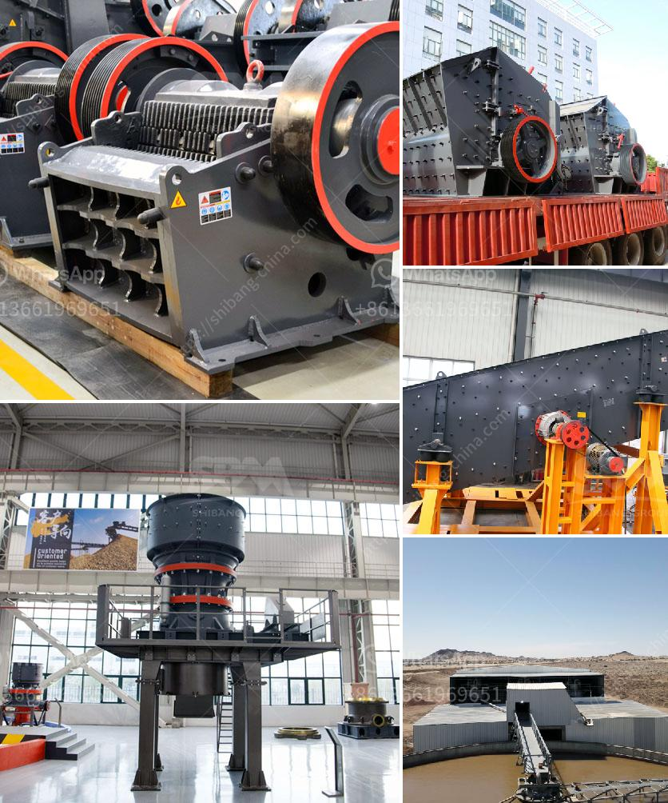

<h3>series capacitor for crushing plant</h3>
Series capacitors are an essential component of a crushing plant, playing a crucial role in ensuring the efficient operation and protection of the machinery. These capacitors are designed to provide power factor correction and harmonics mitigation, thereby improving the plant's overall power quality and reducing energy consumption.

In a crushing plant, various machines such as crushers, screens, conveyors, and feeders work simultaneously to process and crush large rocks or minerals. This continuous operation calls for a reliable and smooth power supply to avoid any disruptions or damage to the machinery. However, the starting and stopping of these heavy-duty machines can cause power surges and voltage fluctuations, leading to inefficiencies and potential breakdowns.

This is where series capacitors come into the picture. These capacitors are connected in series with the equipment and help regulate the power supply by storing and releasing electrical energy as needed. One significant advantage of using series capacitors is their ability to improve power factor correction.

Power factor is a measure of the efficiency of the power flow in an electrical system. It indicates the percentage of true power (measured in watts) that is effectively used to perform useful work. In a crushing plant, a low power factor can result in higher energy consumption and increased electricity costs. By installing series capacitors, the power factor can be improved, leading to a more efficient use of energy.

Additionally, series capacitors help mitigate harmonics, which are unwanted frequencies that can distort the power supply. Harmonics are caused by nonlinear loads such as crushers and often result in voltage and current waveform distortions. These distortions can affect the performance of the machinery, lead to increased wear and tear, and reduce efficiency. By incorporating series capacitors, harmonics can be filtered and minimized, ensuring a stable and clean power supply to the crushing plant.

Moreover, series capacitors are built to withstand the demanding conditions of a crushing plant. They are designed to be rugged, durable, and resistant to high temperatures, vibrations, and shocks. This ensures their longevity and reliability in the harsh operating environment.

It is worth noting that series capacitors should be carefully selected and appropriately sized for the specific requirements of the crushing plant. Consulting with experts and conducting a thorough analysis of the electrical system is essential to determine the correct capacitor rating and configuration.

In summary, series capacitors are a critical component of crushing plants, offering power factor correction, harmonics mitigation, and overall power quality improvement. Their installation can lead to increased energy efficiency, reduced downtime, and improved equipment performance. Choosing the right capacitors and working with knowledgeable professionals is crucial to optimize the benefits of series capacitors in a crushing plant.
<h3>Contact us</h3><ul><li><strong>Whatsapp:&nbsp;<a href="https://wa.me/8613661969651">+8613661969651</a></strong></li><li><a href="https://swt.shibang-china.com/?git&amp;zhl&amp;series capacitor for crushing plant"><strong>Online Service(chat now)</strong></a></li></ul><h3>Related</h3><ul><li><a href='sand crushing grinding screening production machinerys.md'>sand crushing grinding screening production machinerys</a></li><li><a href='standard operating procedure for cement manufacturing.md'>standard operating procedure for cement manufacturing</a></li><li><a href='stone crusher process.md'>stone crusher process</a></li><li><a href='conveyor belts bogota.md'>conveyor belts bogota</a></li><li><a href='mobile vibrating screens.md'>mobile vibrating screens</a></li></ul>